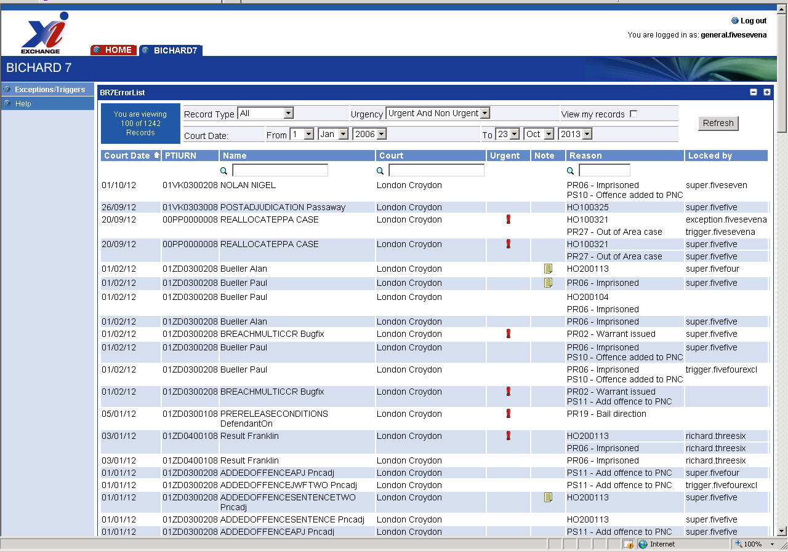
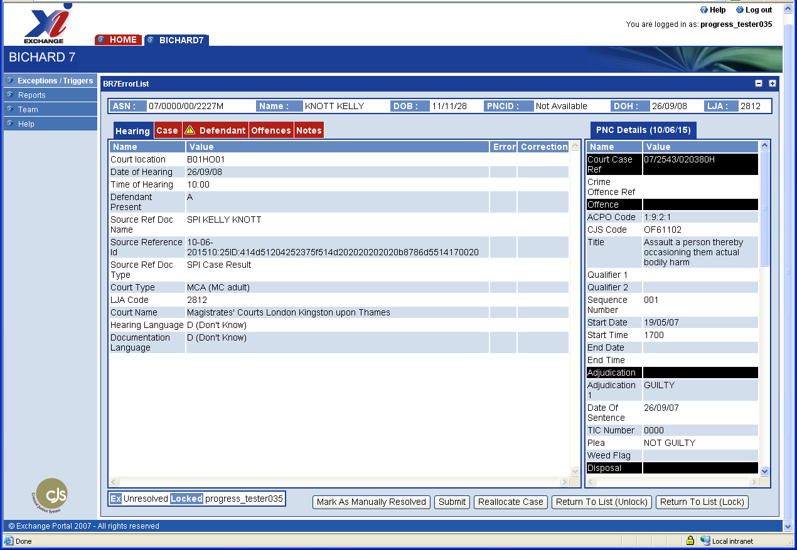
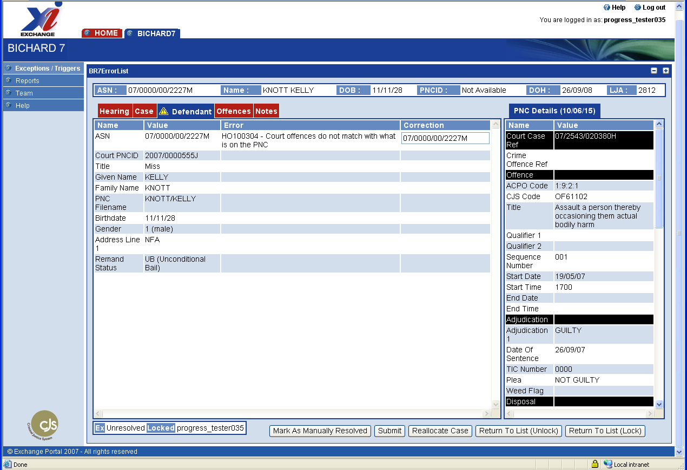
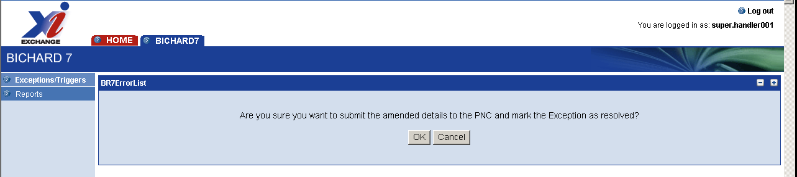
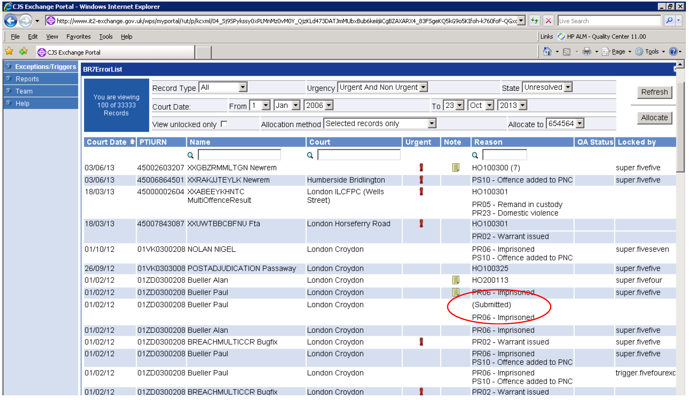
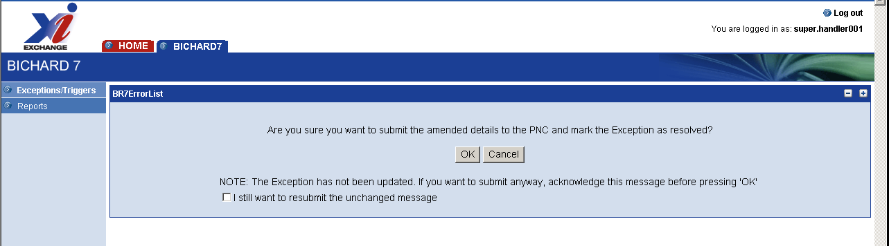

## What is an Exception?

Exceptions generally occur when there is an issue with the data and the Bichard 7 solution cannot automatically update PNC with the court hearing result. Not all exceptions are a result of errors, either with the court result or PNC, but may be because the result is complex requiring operator intervention e.g. breaches of a court order. 
There are numerous reasons as to why an exception may occur, and the top errors seen are explained further in this document.

Exceptions fall into two main categories: 

**Pre-hearing outcome publication** – where there are errors found when completing Bichard 7 checks e.g. an invalid ASN meaning the entry cannot be satisfactorily identified on PNC. 

**Post hearing outcome publication** – where the entry has been correctly identified on PNC but the offence cannot be updated e.g. a result may already be on the PNC.

## Results and exception ownership 

Most cases are heard at courts based in the same criminal justice area as the force that brought the prosecution. However, cases can be heard "out of area". Bichard 7 will always attempt to pass the case back to the owning force; if this is not possible (for example if the ASN and PTIURN have not been recorded correctly at court) then the case will default back to the local force for the court. 

## Handling exceptions on behalf of another force

Forces are responsible for exceptions arising from their own cases, and those cases that have been heard in their court area for which no force can be determined. This is possible if: 
- The Force Owner is incorrect on PNC 
- The force code part of an ASN or PTI-URN is provided but incorrect or,
- No ASN or PTI-URN is provided.

The procedure to follow is:

If the correct Force Owner or ASN is available (for instance on paperwork or from PNC) and if the portal allows the Force Owner or ASN to be corrected then these should be fixed and the case resubmitted. The case will then be sent to the correct force. Otherwise; 

If the exception is straightforward, the force that received it should result the case itself. Otherwise; 
A copy of the register should be sent to the owning force and the exception marked as 'Manually Resolved'. 

## Ensuring Completeness

Forces need to ensure that all cases where they are the prosecuting authority have been resulted. This will involve reviewing the standard PNC reports of outstanding IPs distributed to all forces. 

## How to resolve an exception via the portal

Exceptions can be rectified either by using the portal and resubmitting to PNC or manually through another channel e.g. direct onto PNC using a dedicated PNC terminal. 

An exception is the outcome of a hearing with one or more errors e.g. if the ASN is incorrect it will show errors with the defendant, offences and/or PNC. Correcting the error and resubmitting to PNC should rectify the exception created. 
When you log on you are presented with a list of cases within the portal for your area. These show the identifying features of the case and the reason for the exception. All exceptions on the error list start with the code HO. 

## Viewing Exceptions

You can view the list of exceptions via Bichard:

Clicking on the defendant name will display a split screen containing details of that case hearing.

The left hand side shows the information from the courts with 5-7 tabs across the top, blue for the current screen being viewed and red for the others. A yellow triangle is displayed indicating where the error has occurred. Clicking on the tab with the triangle displays the details relating to that tab and the error associated with it.

The right hand side shows the PNC entry for that defendant.

An entry is locked when it is opened, or can be manually locked if it has not already been locked by another user. This prevents another user inadvertently amending your record.

The following fields are editable:

- Arrest Summons Number
- Offence Sequence Number
- Result Text
- Next Appearance Location
- Next Appearance Date
- Court Offence Reference Number
- PNCID
- Disposal Qualifier – Code
- Court Reference
- CCR

Only the Result Text is always editable; all others are only editable when an error has occurred in that particular field and the data to be corrected appears in a box.

## Editing Fields

If the field has been edited then the warning triangle is marked with a tick (see screenshot below) to show that the area has been dealt with.

If you have resolved the exception on the portal click on the 'submit' button at the bottom of the screen which will show you a confirmation screen. If you are sure you wish to submit the resolution to PNC click OK, if not click Cancel which takes you back to your entry.

When the case has been submitted your error list is updated and the reason heading for that entry shows 'submitted'. By clicking on the refresh button (or F5) the entry will disappear if successfully submitted and no further action is necessary. If not successfully submitted the entry will re-appear with updated actions required.

If you do not amend the entry but submit the entry to PNC the same confirmation screen appears but with an added box for you to check and it informs you the entry has not been updated and invites you to submit the entry anyway to PNC. If the update is successful the error list will display 'submitted' and if refreshed the entry will disappear. If unsuccessful the entry will re-appear when the list is refreshed.

## Marking a case as manually resolved on the PNC

If you have manually resolved the error click the 'mark as manually resolved' button at the bottom of the screen. This shows you a resolution screen with a drop down list of commonly used manual resolutions. Please ensure the correct option is chosen as it will affect your automation rate. Click OK and the entry will no longer appear on your active error list.

## Returning to the error list

Generally when you mark an exception as manually resolved then you are automatically returned to the Error List screen as the case is now resolved. However if you are a General Handler or a Supervisor and there are still outstanding triggers on the case which you could resolve then you remain in the Exception/Trigger detail screen giving you the opportunity to resolve the triggers before leaving the case.

If you resubmit the exception then you are always automatically returned to the Error List screen, irrespective of any outstanding triggers as it is unwise to handle triggers while the case is being reprocessed as the triggers may change. 

## Exceptions List

Pre Hearing Publication Errors ('validation' errors) - Error Codes & Messages:

| Error ID | Message |
|----------|---------|
| HO100100 | Bad value (general catch-all) | 
| HO100101 | Value required (general catch-all) | 
| HO100102 | Bad date | 
| HO100103 | Bad time | 
| HO100104 | Bad timestamp | 
| HO100105 | Bad integer | 
| HO100106 | Too short (catch-all) | 
| HO100107 | Too long (catch-all) | 
| HO100108 | Value is not allowed for the field | 
| HO100109 | Number too small | 
| HO100110 | Number too large | 
| HO100111 | Bad decimal | 
| HO100200 | Invalid Organisation Unit Code | 
| HO100201 | Bad PTI-URN format | 
| HO100202 | Bad Case Marker | 
| HO100203 | Bad Court Case Reference Number format | 
| HO100206 | Bad Arrest Summons Number | 
| HO100207 | Bad CRO Number format | 
| HO100208 | Bad Driver Number format | 
| HO100209 | Bad PNC Identifier format | 
| HO100210 | Bad PNC Checkname format | 
| HO100211 | Bad Organisation Name format | 
| HO100212 | Bad Title | 
| HO100213 | Bad Given Name | 
| HO100214 | Bad Requested Name | 
| HO100215 | Bad Family Name | 
| HO100216 | Bad Suffix | 
| HO100217 | Bad Address Line | 
| HO100219 | Bad Bail Conditions | 
| HO100220 | Bad Reason For Bail Conditions | 
| HO100224 | Bad Act Or Source (Part of Offence Code) | 
| HO100226 | Bad Common Law Offence | 
| HO100227 | Bad Reason (Part of Offence Code) | 
| HO100228 | Bad Offence Reason Sequence | 
| HO100230 | Bad year | 
| HO100231 | Bad month | 
| HO100232 | Bad Location Of Offence | 
| HO100233 | Bad Offence Title (Lookup failed) | 
| HO100234 | Bad Wording (Lookup failed) | 
| HO100235 | Bad Actual Statement Of Facts | 
| HO100236 | Bad Home Office Classification (Lookup failed) | 
| HO100237 | Bad Alcohol Level Amount | 
| HO100238 | Bad Vehicle Registration Mark | 
| HO100239 | Bad Court Offence Sequence Number | 
| HO100240 | Bad CJS Result Code | 
| HO100241 | Bad Result Applicable Qualifier Code | 
| HO100242 | Bad Duration Length | 
| HO100243 | Bad Amount Specified In Result amount | 
| HO100244 | Bad Number Specified In Result amount | 
| HO100245 | Bad Result Variable Text (Must not be empty) | 
| HO100246 | Bad PNC Disposal Type | 
| HO100247 | Bad Result Qualifier Variable Code | 
| HO100248 | Bad Result Qualifier Variable Text | 
| HO100249 | Bad Court House Code | 
| HO100250 | Bad Area Code (Part of Local Offence Code) | 
| HO100251 | Bad Offence Code (Part of Local Offence Code) | 
| HO100300 | Organisation not recognised | 
| HO100301 | ASN not found on PNC | 
| HO100302 | PNC query failed (e.g. communication failure, timeout) | 
| HO100304 | Court offences do not match with what is on the PNC | 
| HO100305 | Conviction/Hearing dates and/or Verdict do not make sense | 
| HO100306 | Offence Code not found (Lookup failed) | 
| HO100307 | Result Code not found (Lookup failed) | 
| HO100309 | Result Code Qualifier not found (Lookup failed) | 
| HO100310 | Multiple Court Offences with different Results match a PNC Offence | 
| HO100311 | Duplicate Court Offence Sequence Number | 
| HO100312 | No PNC Offence with this Sequence Number | 
| HO100313 | PNC Query returned a business error | 
| HO100314 | PNC Query returned a system fault (e.g. returned an unexpected error code) |
| HO100315 | PNC Query returned a warning | 
| HO100316 | PNC Query returned an invalid Offence Sequence (reference) number | 
| HO100317 | PNC Query returned a duplicate Offence Sequence (reference) number | 
| HO100318 | PNC Query returned an invalid Court Case Reference number | 
| HO100320 | Sequence number identifies a non-matching Offence | 
| HO100321 | Dummy ASN not allowed when Offences/Results are recordable | 
| HO100322 | Next Result Source Organisation is absent for a remand. | 
| HO100323 | Next Hearing Date is absent for a remand. | 
| HO100324 | Adjournment pre Judgement but PNC has an adjudication |
| HO100325 | Inconsistent result: Adjournment post Judgement but PNC does not have an adjudication |
| HO100326 | Inconsistent result: Sentence but PNC does not have an adjudication |
| HO100328 | Unable to determine whether fixed penalty or court case should be resulted | 
| HO100329 | Unable to identify correct fixed penalty | 
| HO100331 | Case has 100+ offences - refer to court register | 
| HO100332 | Offences match more than one CCR | 
| HO100333 | Manual match detected but no case matches upon resubmission, suggesting ASN updated or PNC data updated manually before resubmission |
| HO100401 | PNC Update returned a business error | 
| HO100402 | PNC Update returned a system fault (e.g. returned an unexpected error code) | 
| HO100403 | PNC Update returned a warning | 
| HO100404 | PNC Update failed (e.g. communication failure, timeout) | 
| HO100507 | Offences added by court at Penalty Hearing | 

Post Hearing Outcome Publication ('update' errors):

| Error ID | Message |
|----------|---------|
| HO100201 | Bad PTI-URN format |
| HO200100 | Inconsistent result: Adjournment pre Judgement but PNC has an adjudication |
| HO200101 | Inconsistent result: Adjournment with Judgement but PNC has an adjudication |
| HO200103 | Inconsistent result: Adjournment post Judgement but PNC does not have an adjudication |
| HO200104 | Inconsistent result: Judgement with final result but PNC has an adjudication |
| HO200106 | Inconsistent result: Sentence but PNC does not have an adjudication |
| HO200108 | Insufficient information to create reference for 'Refer to Court Case'. |
| HO200109 | Invalid operation sequence: Results in the Hearing Outcome are not consistent |
| HO200110 | Non-police / Dummy ASN encountered |
| HO200111 | Unknown order varied/revoked result code |
| HO200113 | The PNC cannot be updated automatically because there are new remands together with sentencing. It will have to be done manually.
| HO200114 | The PNC cannot be updated automatically because there are changes to existing disposals together with sentencing. It will have to be done manually. |
| HO200115 | The PNC cannot be updated automatically because there are changes to existing disposals together with new disposals. It will have to be done manually. |
| HO200117 | Too many results present - review on PNC |
| HO200118 | Cannot generate PNC updates because the relevant results are in the result stop list. |
| HO200121 | Business Error: Cannot generate PNC updates because there are no offences that can be sent to the PNC. |
| HO200124 | The PNC cannot be updated automatically because there are adjudications together with existing final results. It will have to be done manually. |
| HO200200 | PNC disposal Text exceeds 64 Characters |
| HO200201 | Result Qualifier Duration is present |
| HO200202 | Too many Result Qualifiers present |
| HO200203 | Too many Bail Conditions present |
| HO200204 | Bail Condition Text too long |
| HO200205 | Amount Specified In Result too large |
| HO200212 | Offence has no valid PNC results |