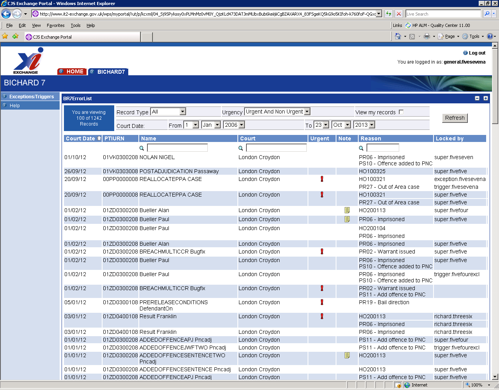
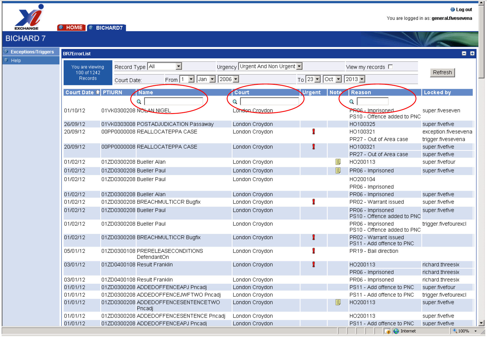
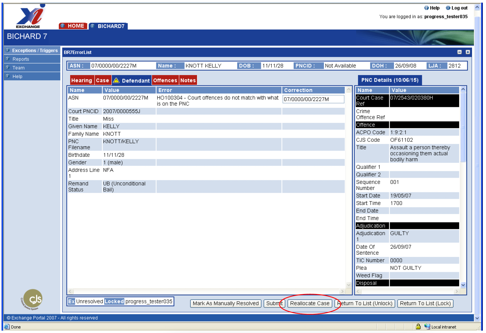
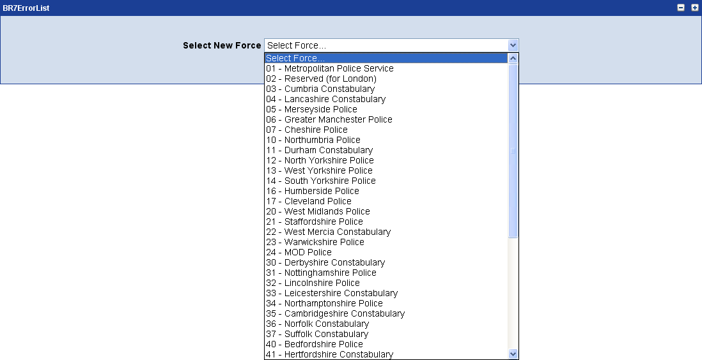
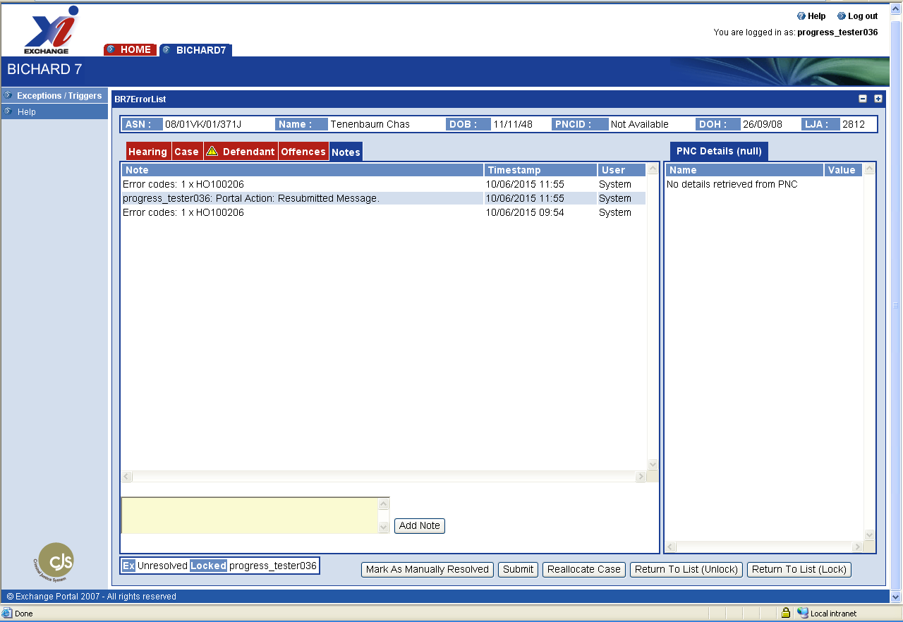

The Bichard 7 application operates in the same way as it has previously.

## Bichard Roles

When users are setup on the Bichard 7 portal, they are assigned a specific role which determines which actions the user is able to undertake on the portal. Users can be assigned one of the following roles.

**Exceptions Handler**: is able to view and update exceptions for the areas specified in the setup and reallocate exceptions to another force area.

**Trigger Handler**: is able to view and update the triggers for the areas specified in the setup and reallocate trigger only cases to another force area.

**General Handler**: is able to view and update both triggers and exceptions and reallocate cases to another force area.

**Supervisor**: is able to view triggers specified in setup, view exceptions, reallocate cases, unlock results, undertake quality audits, allocate results to users and run management information reports. The Supervisor role now also allows users to create/edit and delete users within their own allocated Force.

**Audit**: is able to view resolved and unresolved exceptions and triggers, but not update them (i.e. this is read only access).

## Basic Navigation

After logging on you will be presented with the home screen which has allows you to log in to Bichard or manage the users for your force (if a User Manager). Clicking on the "Access Bichard" button takes you to the list of exceptions and triggers for your force. The contents of this list will depend on the permissions you have been granted.

You can select the entries you wish to see by using the filters at the top of the screen, by clicking on the arrows the drop down list shows you which values you can select.

This list shows the identifiers for the case, the first error encountered by the automated process and includes a marker for any urgent results.

When you select a defendant by clicking on their name a new page appears giving full details of the selected hearing outcome.

### Filtering records

You can filter by the fields in the table. Different user types can see different filters:

#### Record type

Possible values: All, Exceptions, Triggers

User types able to view: Supervisor, Auditor, General Handler, Trigger Handler

#### Urgency

Possible values: Urgent, Non urgent

User types able to view: All

#### Record type

Possible values: All, Exceptions, Triggers

User types able to view: Supervisor, Auditor, General Handler, Trigger Handler

#### State

Possible values: Unresolved, Resolved

User types able to view Unresolved: All

User types able to view Resolved: Supervisor, Auditor

#### Court Date

Possible values: From and to dates

User types able to view: All

#### View my records

Possible values: Ticked and Unticked

User types able to view: All

#### View unlocked only

Possible values: Ticked and Unticked

User types able to view: Supervisor

#### Allocation method

Possible values: Selected records only, Top 1-20 unallocated records, All unallocated records shown

User types able to view: Supervisor

#### Allocate to

Possible values: Users in team

User types able to view: Supervisor

When you have selected your filter values, click on the refresh button at the top right of the screen to show the selected exceptions or triggers.

## Searching

The search facility will allow users to lookup records via a defendant name or by court. The search looks for an exact match to the search term entered. A common search facility (known as a wildcard) is used to allow users greater flexibility in searching. A wildcard is a character that may be used in a search to represent one or more characters – this is an asterisk '\*'. Wildcards can be used at the start, end or in the middle of words, e.g. S*H would return both Smith and South.

It should also be noted that searches are NOT case sensitive.

Below are some specific examples of how to search for a defendant and court.

### Defendant search example

Defendants are listed in the portal in the format Surname/Firstname (without a slash). To search for a defendant with a surname of Smith, the following search would be required. Note that the asterisk, written as '*', is added after the defendant's surname, as we are unsure of the defendant's first name.

`Smith*`

This would return

Smith Robert, Smith David, etc….

Alternatively, if only the first name is known, adding an asterisk before the first name will return all the relevant results. To search for all the defendants with the first name of Robert, an asterisk is required before the first name, as the format is Surname Firstname.

`*Robert`

This would return

Smith Robert, Davies Robert, etc…

### Court search example

The court search also works in a similar way. A wildcard ( '*' ) is required when searching for court locations. The format that courts are displayed in is area / sub area (without slash), therefore a search for all cases in Westminster would be:

`*Westminster`

This would return results for London Westminster Magistrates' Court

### Exception and Trigger search example

The search works on a single Error Code or Trigger Code. If the search string starts with HO it will search exceptions and if TR it will search triggers. No wildcard can be used.

`HO100321` to search for all unresolved exceptions with the code HO100321

`TRPR0001` to search for all unresolved triggers with the code TRPR0001

If a trigger code has been searched for then the summary list will only show the trigger entries (i.e. it will not show the exception details, should an exception also exist on the record). If an error code has been searched for the summary list will only show exceptions.

The reason field on the Summary List will be populated with the text short description of the trigger code/the error code that the user searched for (rather than the first error/trigger on that record, as is displayed in the unfiltered listing).

## Reallocating a case to another Force Area

If a case is received and your force is either no longer the owner of the case, or your force has received the case as the correct force could not be identified from the ASN/PTI-URN, then the case can be redirected to the correct force.

Select and click on the name of the defendant you wish to transfer, then click on the Reallocate Case button.

When clicking on the Reallocate Case button, the following screen appears and allows you to select a new force.

Click on the OK button after selecting a new Force. If the Force is different than the original force on the case, you will be returned to the Summary List screen, where the case is no longer listed.

Note that, if you want to add a note explaining why the case has been reallocated, you would have to do it before selecting the Reallocate Case button.

## Adding Notes To Cases

The notes screen is a useful feature that allows you to document your progress in resolving specific exceptions. This allows users to easily share information in the portal, rather than relying on separate emails.

The notes screen shows portal activity and allows you to enter details in a dialogue box, clicking on the 'add note' button. The note is time stamped and the user identified. The maximum number of characters that can be entered into the Notes field is 1000.

Note: Text in the Notes Field is not archived and therefore not recoverable once the case has been removed from the Portal, which will occur 35 days after being marked as complete.

All notes added to a case, whether they are user entered notes or system generated notes can be viewed by clicking on the 'Notes' tab as above.

You can view the last user entered note on a case from the Error List screen by hovering your mouse over the Icon in the Note field column. The note will be visible for approximately 10 seconds; you can view the note again by moving your mouse back over the Note icon. Only the first 100 characters of the note will be displayed. If the note is longer than 100 characters and you wish to view the full note, you can do so by selecting the case and viewing the 'Notes' tab.

If a note is longer than 1000 characters it will appear split into multiple notes. The notes will be split at the nearest word boundary to 1000 characters, to prevent a word from being cut in half.

Each new note will start with a count to indicate which note in the sequence it is (i.e. "(1/2) …") and the new notes will be ordered such that when read, they follow on logically from one to the next. If a new note has a note after it in the sequence (i.e. note 1 out of 2), it will have an ellipsis (…) appended to the note text to indicate that the note/sentence continues in the next note. Similarly, if a new note has a note prior to it in the sequence (i.e. note 2 out of 2), it will have an ellipsis prepended to the note text to indicate that it is the continuation of a previous note/sentence.
