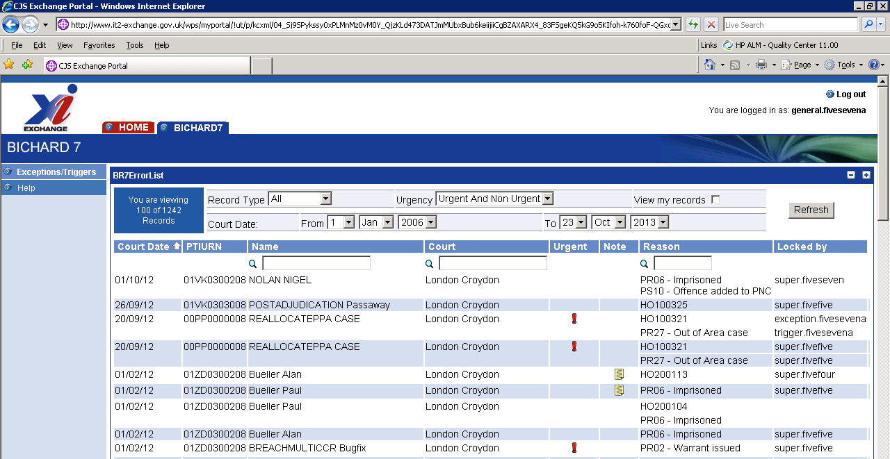
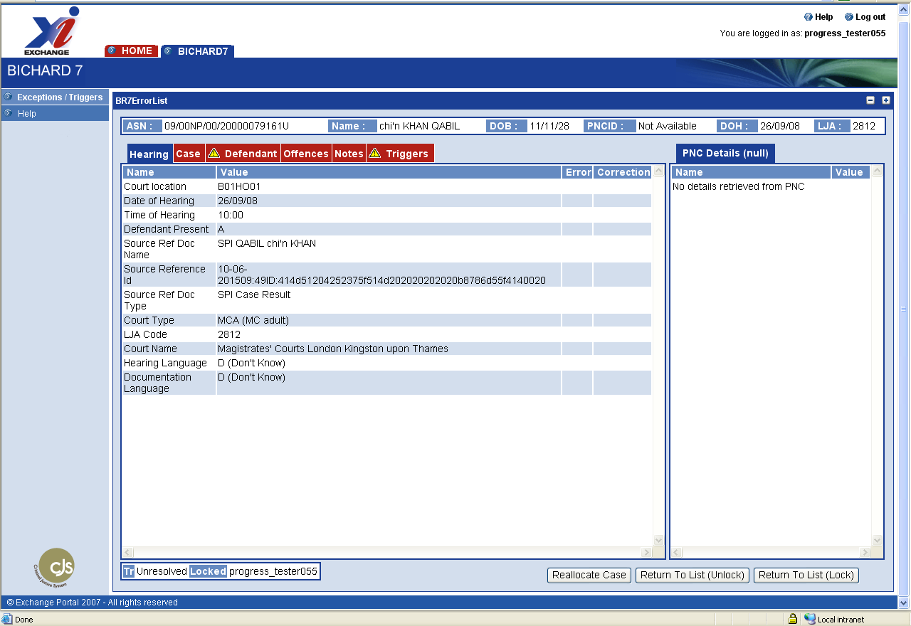
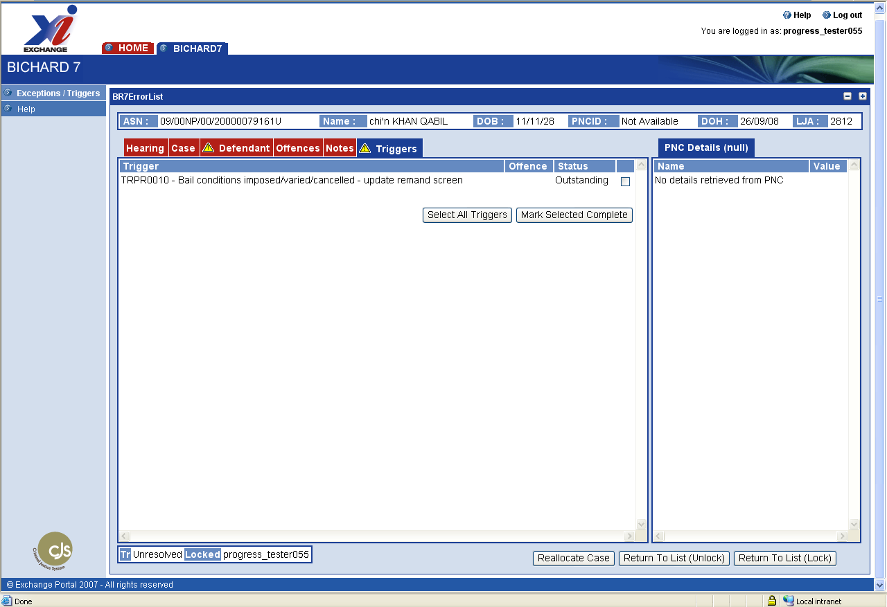
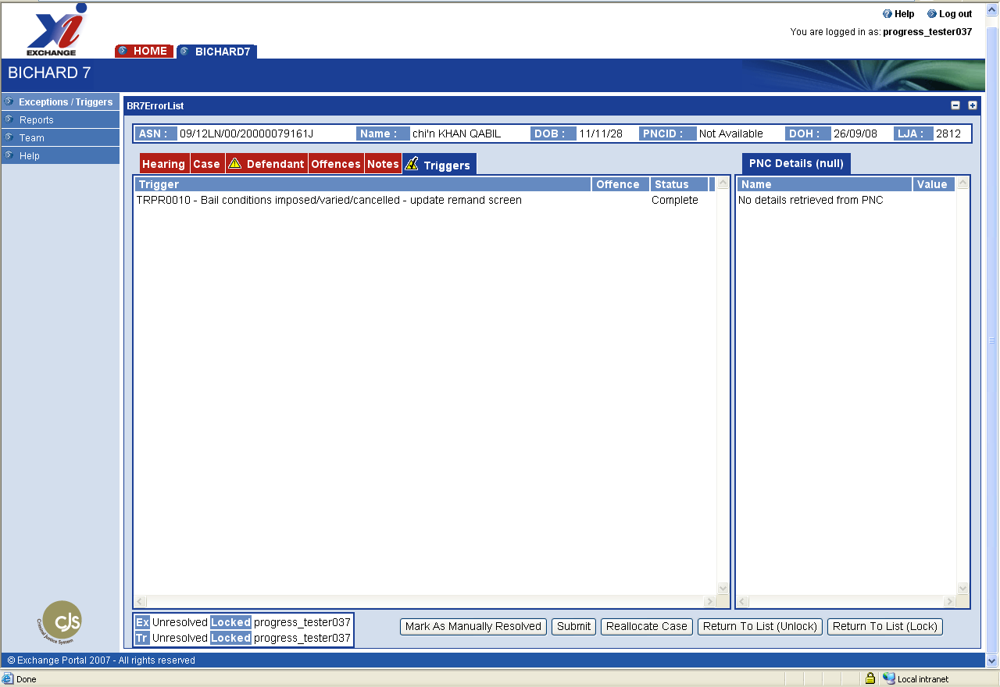
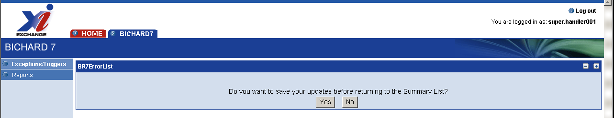
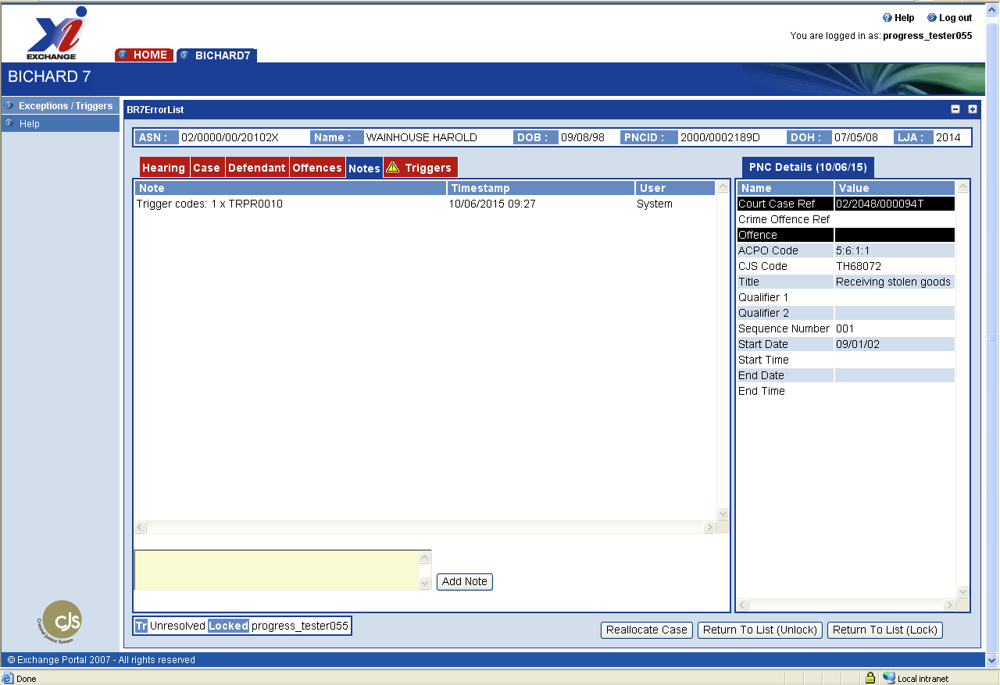
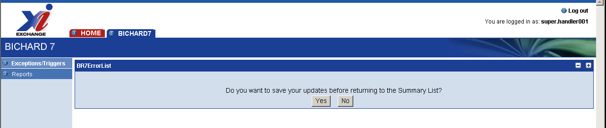
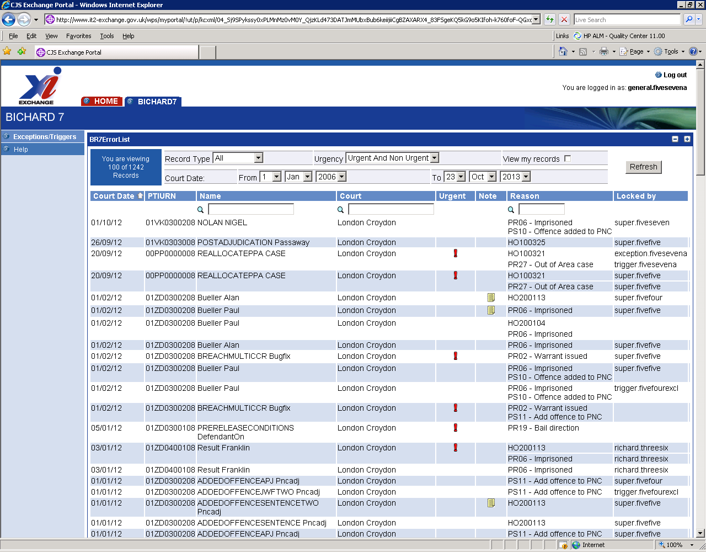
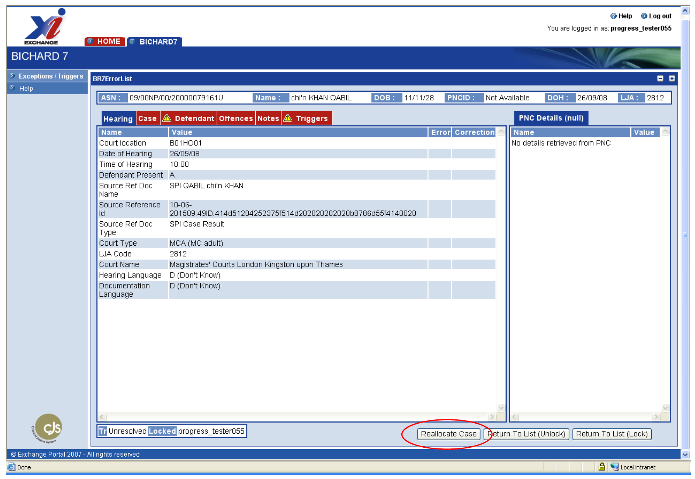
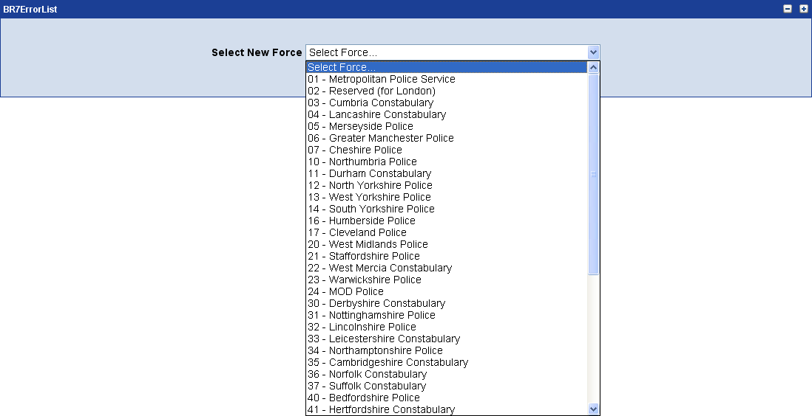

## What is a Trigger?

Triggers are created when a result is passed through the Bichard 7 solution that requires an external system to be updated, for example ViSOR (Violent and Sexual Offenders Register). Examples of triggers include Driver Disqualifications, certain types of orders, and particular disposals. They can also be a prompt to show another action is required although the result has been successfully passed to PNC.
 
If there is more than one trigger these may be dealt with by different handlers e.g. one user may update the Driver Disqualification screen and another user may update the Custody History. You should be aware that a case hearing in the portal may have an exception and a trigger. It is therefore possible that a trigger may be actioned before the exception has been rectified. E.g. the Custody History may be updated as a result of action indicated by a trigger before the impending prosecution is resulted if it has exceptioned.
 
Triggers are categorized into two groups: Pre-update and Post-update. The pre-update ones are sent before the Bichard 7 validation check and the post-update ones are sent after the result has been accepted by PNC.

## How to resolve a trigger

Triggers are actioned outside the portal and should then be marked as complete in the portal.
 
Trigger processing is totally independent of the automated resulting/exception handling process. A result should be automatically updated on the PNC even if it is also being routed to the portal as a 'trigger'. All triggers on the error list start with the code PR or PS. You can filter for specific triggers by searching for them using their FULL code, e.g. 'TRPR0001'.

Select and click on the name of the defendant for the trigger you wish to update.

A yellow triangle in the trigger tab indicates action is required and the status is shown as 'outstanding'.

Click on the trigger tab and the update screen is shown. The text next to the trigger number will indicate to you what action is required. 

When you have successfully completed that action check the box immediately to the right of the outstanding status (where the case has several triggers the "select all triggers" option can be used as a quick way to select all outstanding triggers). Click on the 'mark selected complete' button, this changes the status to 'complete'.

Note that only those triggers which have been set up in your profile will have a checkbox. Any other outstanding triggers on the case will need to be completed by a user from the appropriate team.

If, having clicked the 'mark selected as complete' button, there are no further actions available – all the triggers within your profile have been completed and there is no exception outstanding (or your role is a trigger handler so you cannot resolve it) – then you will be returned to the error report list and this case will be removed from your list.

If you wish, you can leave the case partially resolved with some of the triggers (or an exception) outstanding by clicking one of the 'Return To List' buttons which takes you to a confirmation screen. Clicking either 'yes' or 'no' takes you to your error report list, but 'no' does not save the changes so any triggers which you marked as complete will still be outstanding.

As there are outstanding actions remaining, the case remains in the listing indicating what action is required. The case will not be removed from your list until all actions have been completed.

## Adding Notes To A Trigger

If you have taken action on a trigger but cannot resolve it immediately, the actions you have taken should be entered via the 'notes' tab. By clicking on the 'notes' tab the resultant screen allows you to enter the details in a dialogue box.

By clicking on the 'add note' button you are presented with a confirmation screen. 'Yes' updates the notes for the case and returns you to the summary error list. 'No' returns you to the summary error list without updating the case record within Bichard 7.

If a note is longer than 1000 characters it will appear split into multiple notes. The notes will be split at the nearest word boundary to 1000 characters, to prevent a word from being cut in half.

Each new note will start with a count to indicate which note in the sequence it is (i.e. "(1/2) …") and the new notes will be ordered such that when read, they follow on logically from one to the next. If a new note has a note after it in the sequence (i.e. note 1 out of 2), it will have an ellipsis (…) appended to the note text to indicate that the note/sentence continues in the next note. Similarly, if a new note has a note prior to it in the sequence (i.e. note 2 out of 2), it will have an ellipsis prepended to the note text to indicate that it is the continuation of a previous note/sentence.

Note: Text in the Notes Field is not archived and therefore not recoverable once the case has been archived

## Redirecting a trigger only case to another Force Area

If a case is received and your force is either no longer the owner of the case, or your force has received the case as the correct force could not be identified from the ASN/PTI-URN, then the triggers can be redirected to the correct force. A trigger only handler can only redirect a case if there are no exceptions on/remaining on the case.

Select and click on the name of the defendant you wish to transfer.

Click on the 'Case' tab and then click on the Reallocate Case button.

When clicking on the Reallocate Case button, the following screen appears and allows you to select a new force.

Click on the OK button after selecting a new Force. If the Force is different than the original force on the case, you will be returned to the Summary List screen, where the case is no longer listed.

Note that, if you want to add a note explaining why the case has been reallocated, you would have to do it before selecting the Reallocate Case button.

## Adding/amending access to a trigger

Supervisors are now able to add or amend access to a trigger for a user, via the User Management functionality directly within B7 itself.
