## Supervisor Responsibility - Quality control

The supervisor role allows team leaders to review the exceptions and triggers which have been resolved by the members within their team and undertake a quality review. Exceptions and triggers marked as resolved are available for review up to 35 days after resolution.
 
Once supervisors have reviewed a case, they are able to judge the standard of the resolved exceptions and triggers. They are able to mark the case as 'passed' if they have been correctly dealt with or choose from alternative options to indicate the case has not been completed correctly.
 
## Quality control: exceptions
 
The level of quality control for exceptions will be set by your force in conjunction with PNC guidelines.
As a supervisor you can determine the quality status of each completed entry. On the error list set the 'state' filter to 'resolved' and refresh the screen.                                                                   From resultant list select and click on the name of the entry you wish to quality assess.

Resolved Error List Screen:

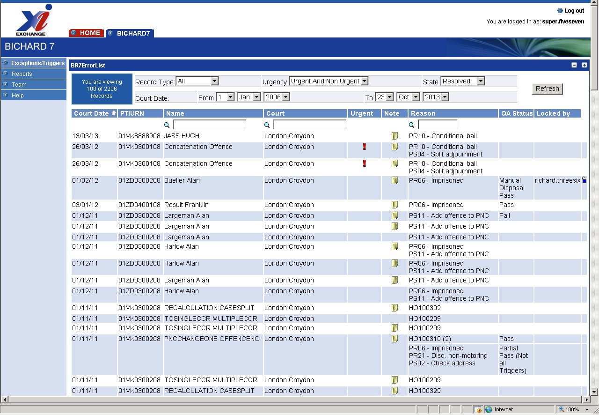

The entry will show the error which should have been resolved with a yellow triangle in the relevant tab.

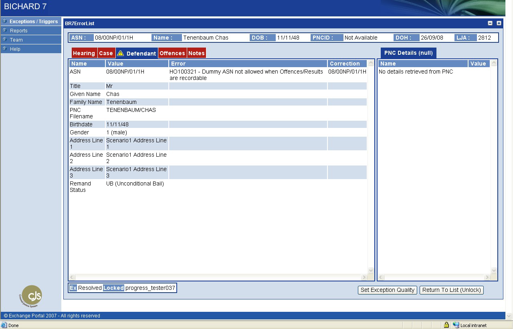

Examine the entry and related notes fields, which may contain further details on the record to assess the quality of the resolution. Click on the 'set exception quality' button at the bottom of the screen which will give you a 'set quality status' screen with a drop down menu of possible options, select the option required:

- Manual Disposal Pass
- Manual Disposal Fail
- Remand Pass
- Remand Fail

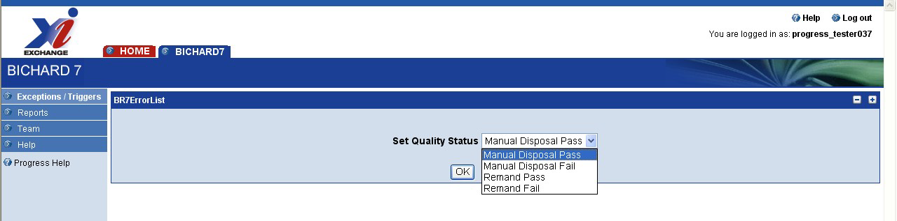

Selecting 'OK' returns you to the resolved error list screen unless the trigger quality also needs to be set, in which case it returns you to the original entry to allow you to set that as well. If you do not wish to set the trigger quality at the same time then selecting 'return to list' asks you to confirm your (partial) quality status update before returning you to the resolved error list screen.

## Quality control: triggers

The level of quality control for triggers will be set by your force. As a supervisor you can determine the quality status of each completed entry. On the error list set the 'state' filter to 'resolved' and refresh the screen. From the resultant list select and click on the name of the entry you wish to quality assess.

The entry will show the trigger which should have been updated with a yellow triangle in the relevant tab.

Resolved Trigger Entry:

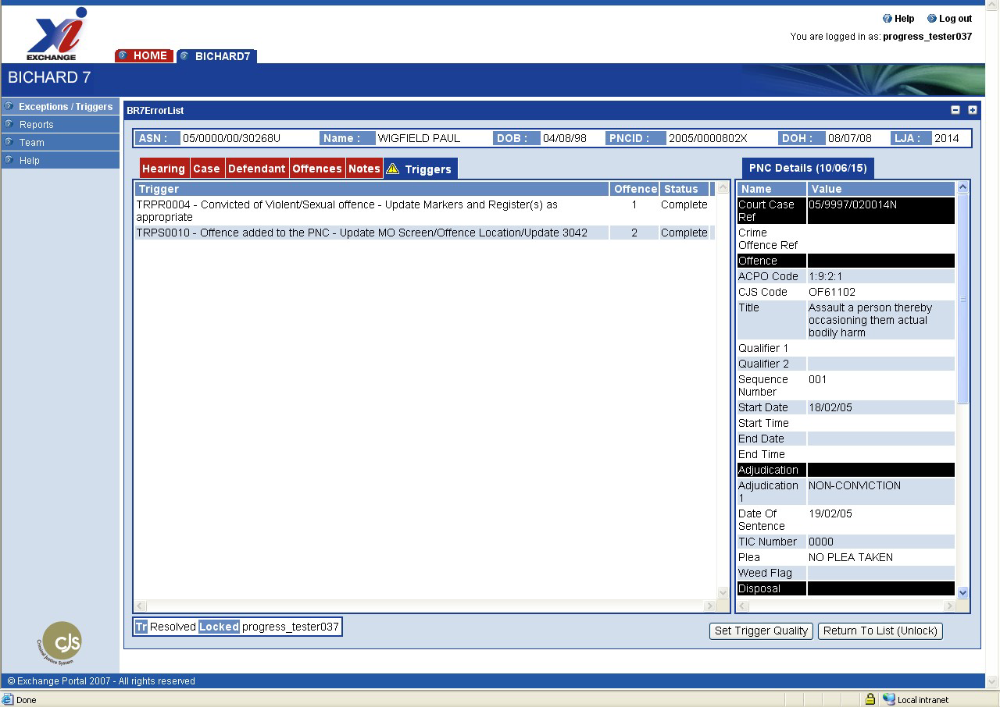

Examine the entry and judge the quality of the resolution. Click on the 'set trigger quality' button at the bottom of the screen which will give you a 'set quality status' screen with a drop down menu of possible options:

- Pass
- Fail
- Partial Pass (not all Triggers)

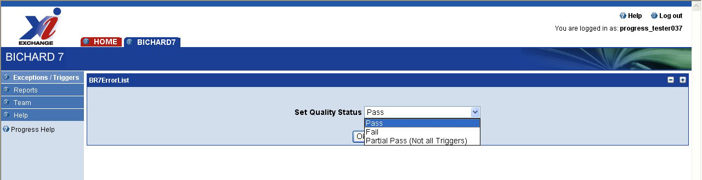

Selecting 'OK' returns you to the resolved error list screen unless the exception quality also needs to be set, in which case it returns you to the original entry to allow you to set that as well. If you do not wish to set the exception quality at the same time then selecting 'return to list' asks you to confirm your (partial) quality status update before returning you to the resolved error list screen.

## Supervisor Responsibility - Operational Reporting

To enable effective monitoring supervisors have access to twelve operational reports, via the portal. [An additional "Work Allocation" report is provided for the London Metropolitan Police only.]

To access these reports log into the portal, click on the Bichard 7 tab at the top of the screen. Click on the reports menu on the left hand side of the screen which will list the reports mentioned below.

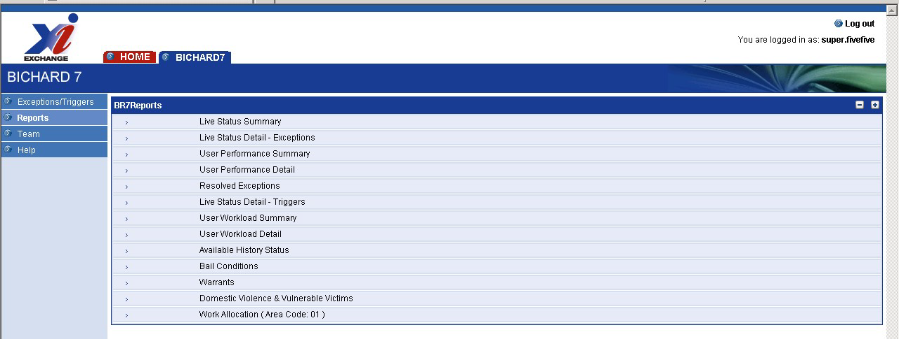

These reports can be downloaded in a comma separated values (CSV) format which can be opened in MS Excel for further analysis. Please ensure that you are using MS Excel 2003 or later with normal UK format settings. If in doubt, please use a text editor (Notepad or similar) to view the "raw" report data to see whether there are any display issues as a result of local settings.

The following section outlines the reports that can be accessed by clicking on the relevantly named report.

### Live status summary

Report shows an overview of outstanding exceptions and triggers. It provides a live summary of:
- Exceptions that require resolution and their status with regard to being, or approaching, "overdue".
- Those triggers that require action and their statuses with regard to being, or approaching, "overdue".

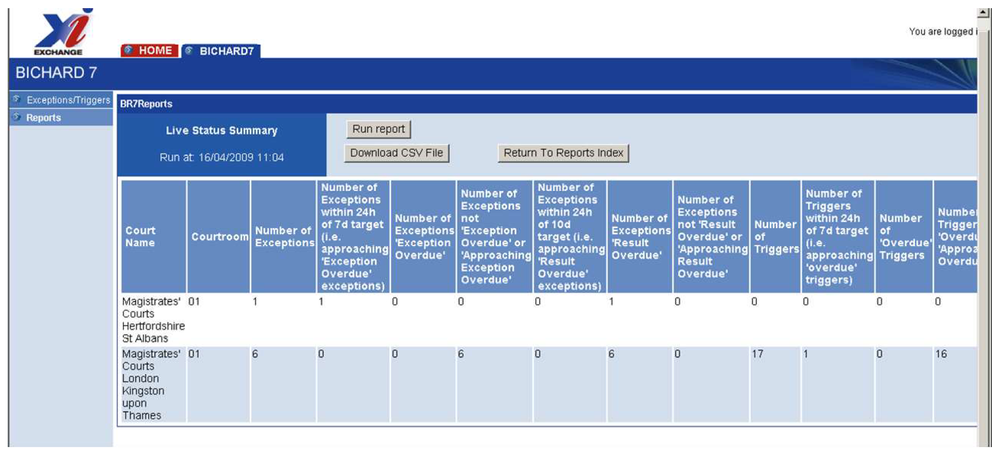

### Live status detail – exceptions

List of Exceptions that are "Overdue" or "Approaching overdue" It allows a manager to prioritise resources on those exceptions that are approaching "overdue" status, and shows which are actually overdue.

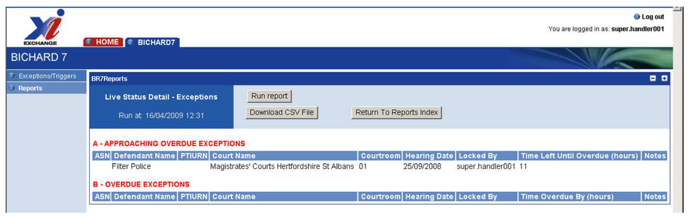

### User performance summary

Overview of work undertaken by users. It allows a manager to monitor and manage staff performance.

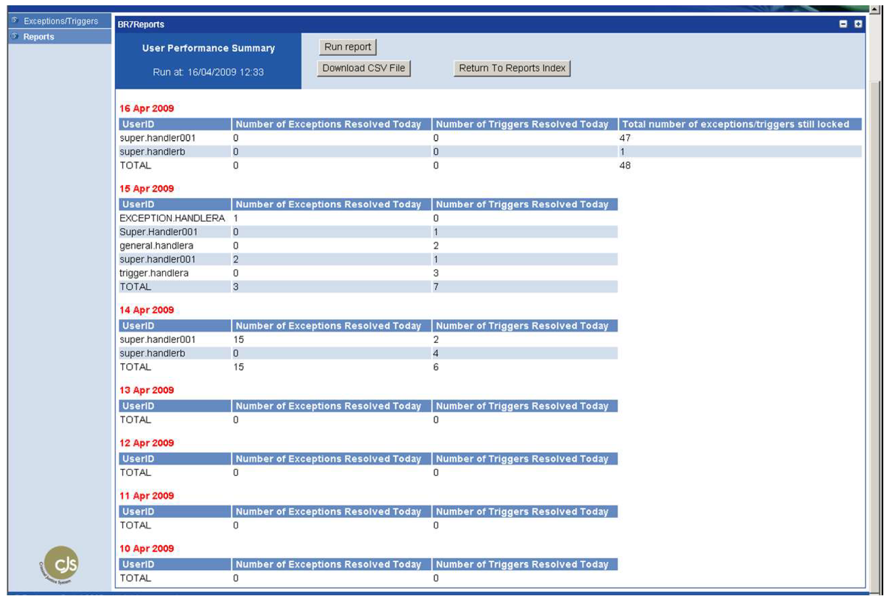

### User performance detail

Detailed breakdown of work undertaken by a user and entries still outstanding in the past calendar month but allows you to select a date range within that month. It allows managers to monitor and manage staff performance via a comprehensive breakdown.

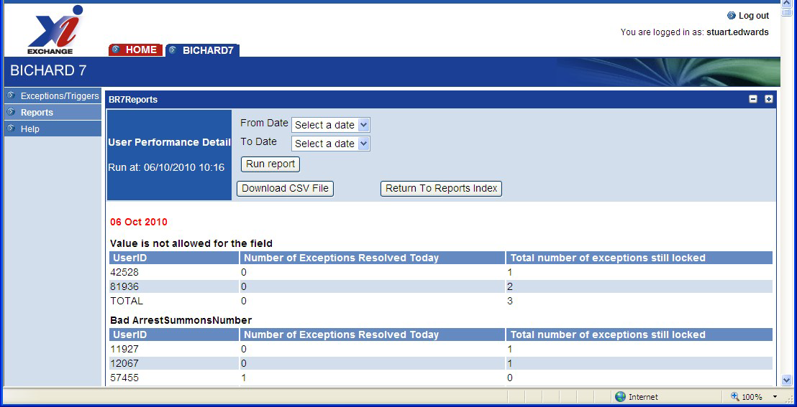

### Resolved exceptions

Lists each individual exception (and/or trigger) that has been resolved on the portal in the past calendar month but allows you to select a date range within that month. To be used for logging and checking purposes.

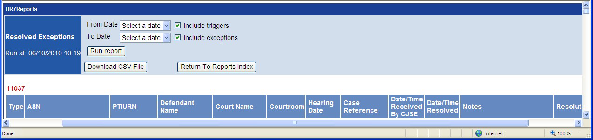

### Live status detail – triggers

Lists triggers that are overdue or approaching overdue. It allows a manager to prioritise resources on those triggers that are approaching overdue status, and shows which are actually overdue.

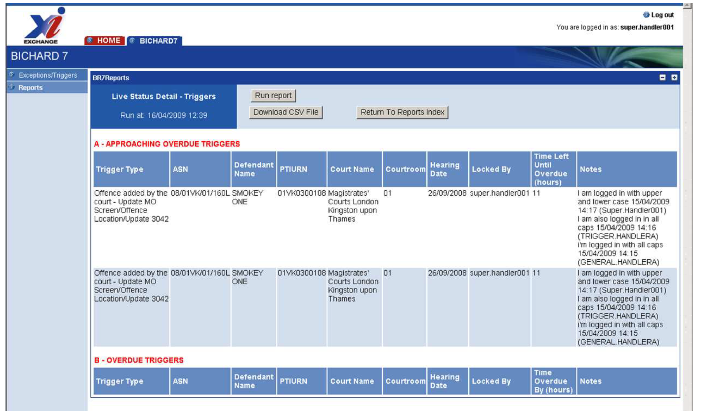

### User workload summary

Overview of users current "locked" records, together with the total number of exceptions/triggers requiring action on these records. It allows a manager to monitor the current workload of their users.

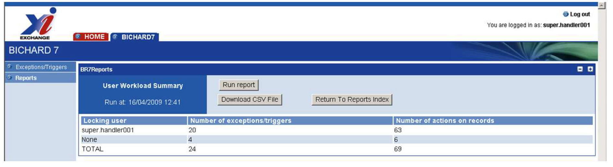

### User workload detail

Details of users current "locked" records, together with the total number of exceptions/triggers requiring action on these records. It allows a manager to monitor the current workload of their users at a detailed level.

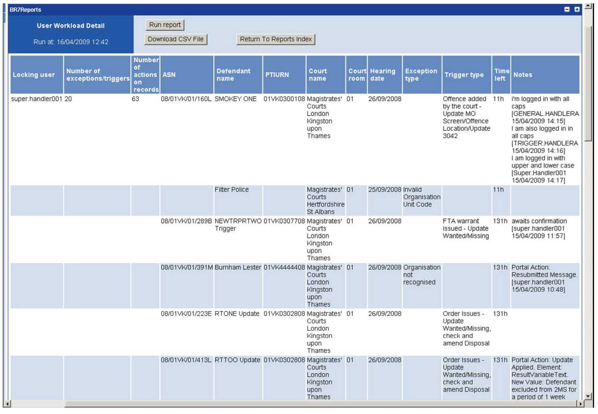

### Available history

Performance figures (i.e. received, resolved and outstanding exception/trigger). It provides a manager with the court resulting statistics for a rolling 35 day period allowing resources to be adjusted to ensure the area meets the national requirements.

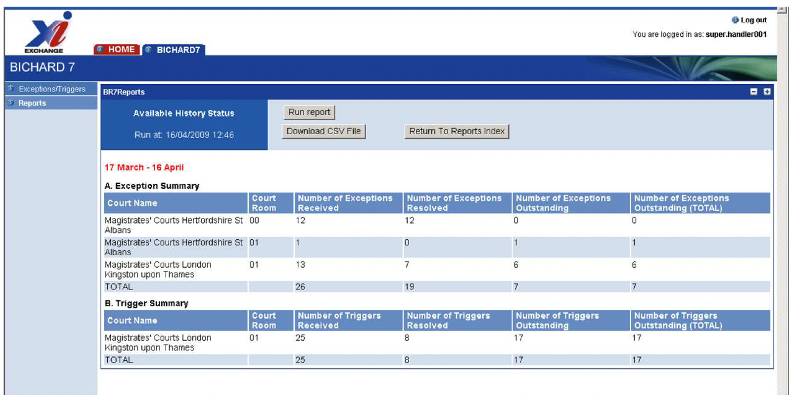

### Bail Conditions

Lists each case which has fired the conditional bail trigger (TRPR0010), whether or not it has been resolved on the portal. Allows you to select a date range within that month – note that this is the date of arrival in the Portal, and not (necessarily) the court hearing date. To be used to support the National Protocol for reporting details of conditional bail.

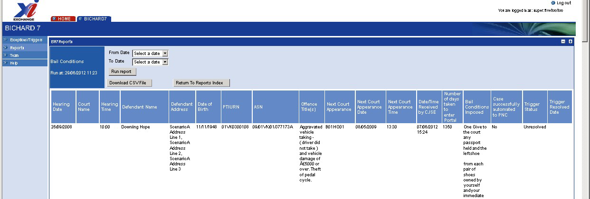

Note that the Bail Conditions Imposed field will contain the text "No bail conditions found" if the bail conditions have been cancelled and the trigger has fired on the presence of the LI (bail conditions cancelled) result qualifier.

### Warrants

Lists each case which has fired the warrant triggers (TRPR0002 or TRPR0012), whether or not it has been resolved on the portal. Allows you to select a date range within the month - note that this is the date of arrival in the Portal, and not (necessarily) the court hearing date. To be used by Warrant teams.

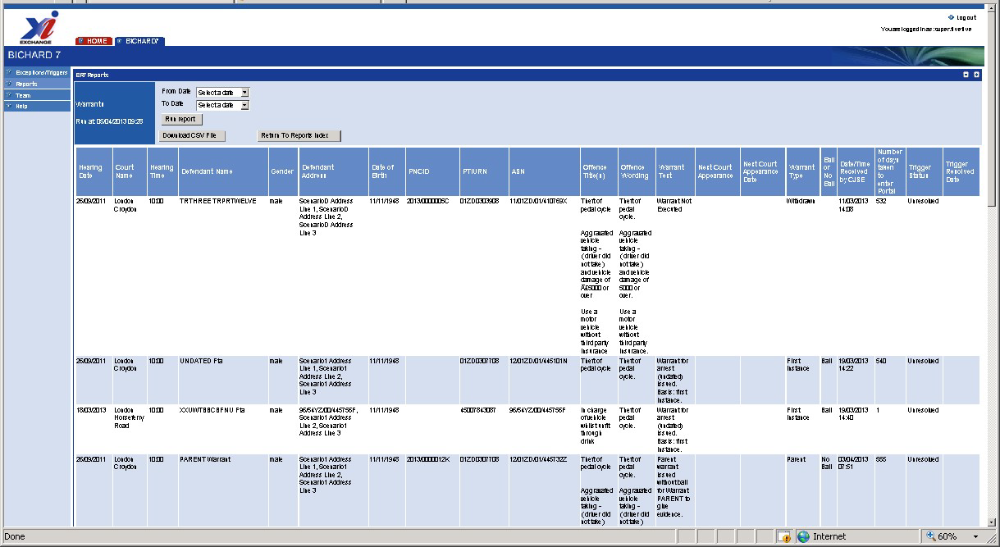

### Domestic Violence / Vulnerable Victim

Lists each case which has fired the domestic violence trigger (TRPR0023) or the vulnerable victim trigger (TRPR0024), whether or not it has been resolved on the portal. Allows you to select a date range within the month – note that this is the date of arrival in the Portal, and not (necessarily) the court hearing date. To be used by Witness Care teams.

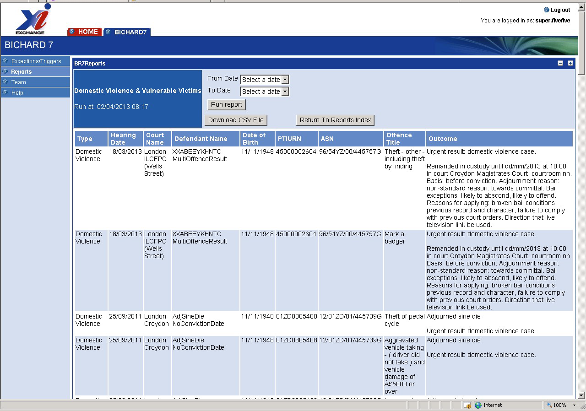

Note that this report contains one line for each offence on the case – so a case may be spread over several lines.

## Allocating exceptions & triggers

Supervisor users can create a team from users setup on the Bichard 7 portal. Once the team has been created, the supervisor is able to allocate triggers and exceptions to their team for resolution. Examples of teams could be multi-site bureaus or where resulting is split between multiple groups of users.

Allocation can be undertaken on an individual hearing basis, or by groups of 5, 10 or 20 hearings at a time. Once these exceptions/triggers have been allocated, the team members will see these as being 'locked' or allocated to them. Supervisors are able to re-allocate exceptions and triggers as necessary but the result must be unlocked first.

Supervisors are also able to unlock entries which have been locked by (or allocated to) a handler - this is not limited to team members. Unlocking is performed by clicking on the padlock icon next to the "Locked by" column on the main summary listing screen.

Users within teams can setup the portal to only view results which they have been allocated. Users are also able to handle exceptions/triggers that have not been allocated to them by a supervisor.

Each supervisor owns one team and they are the only one who can add and delete members (users) from their team. Users may belong to more than one team. Each team belongs to an area (group). The area can be changed on the screen by the owning supervisor. Users are added by entering their user name although it must be typed correctly.

Supervisors may also view other teams within their area. They can add/delete other teams to/from their team which is useful for covering holiday leave. If a supervisor is removed from Bichard 7, their team will be removed also.
