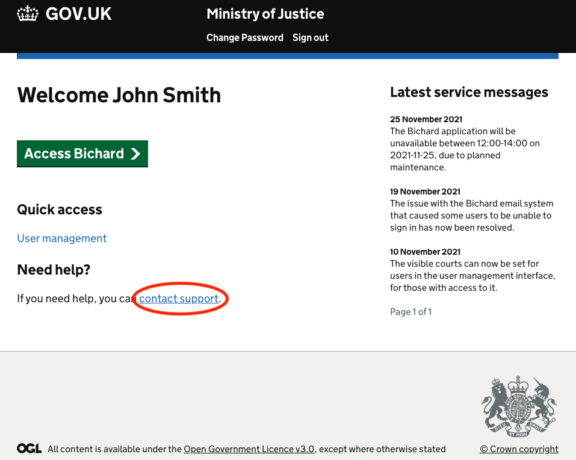

Please note that support contact details for Bichard have changed and that we have new partners supporting the MoJ in delivering the new and improved Bichard application

If you need support prior to logging in to Bichard, please click the "Forgot password" button on the initial Bichard login screen where you are asked to enter your email address (as shown earlier in this document) and then click "Contact us" on the screen which follows.

For any additional support related to the Bichard application, please log a support ticket by clicking on the "contact support" link in the screen you are presented with when you log in to Bichard:

## ServiceNow

By clicking on the "contact support" links mentioned above, you are now directed to the MoJ instance of ServiceNow where you can raise support tickets relating to Bichard. The URL for this is [https://mojprod.service-now.com/](https://mojprod.service-now.com/)

Once here, for first-time login to ServiceNow, you need to click on the "Forgot your login details? Reset them" link which appears just below the login box.

Now, enter your Bichard email address, the same one which you use to login to Bichard itself. You will then be sent an email asking you to set a password, which once set, will enable you to use ServiceNow to raise tickets to the support team.
