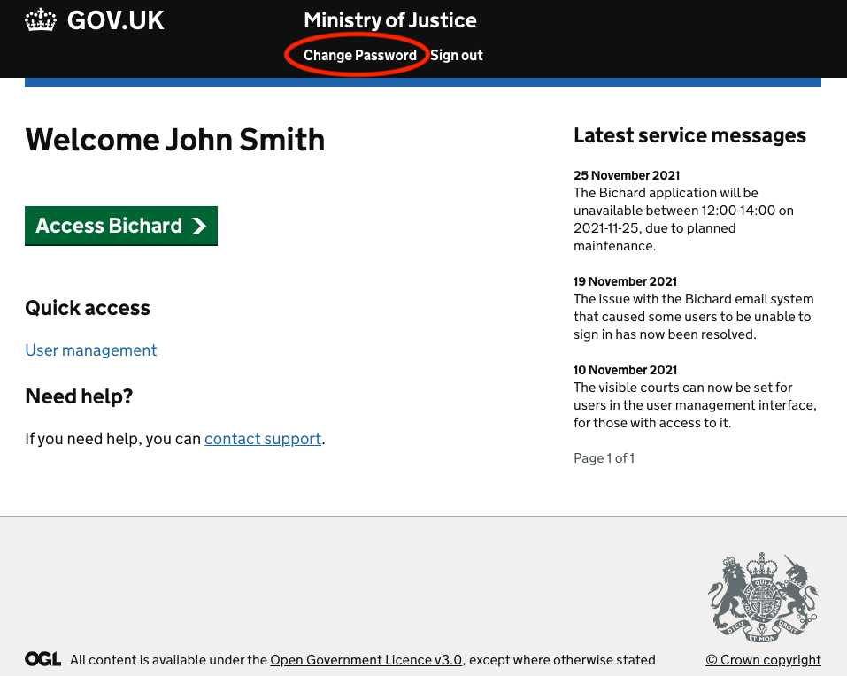
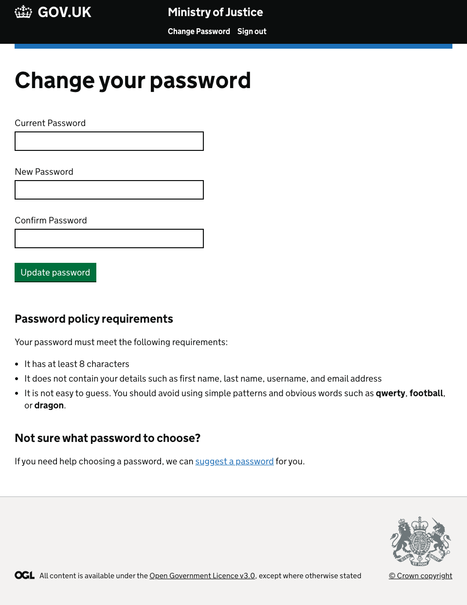
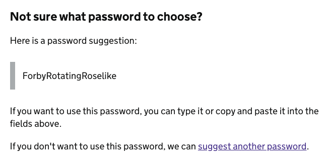

Once you are logged in to Bichard, you now also have the ability to change your current password should you wish to do so.

To do this, log in to Bichard as described earlier in this guide and click on the "Change Password" option which is visible in the banner on the screenshot below:

Once clicked, you will see the screen below:

Once you have entered your current Bichard password, your new desired password and confirmed your new desired password, click on the "Update password" button to change your password.

We have updated the password policy within Bichard and you will now require a strong password. We recommend using three memorable words.

If in-doubt, you can use the "suggest a password" option which will suggest a secure, memorable password for you to use (based on 3 random words) as shown below:

Please also note, passwords should not be re-used or shared. If you suspect your password has been compromised, please change it immediately.

You will then be returned to the login screen and can continue the process to sign in with your new password.
