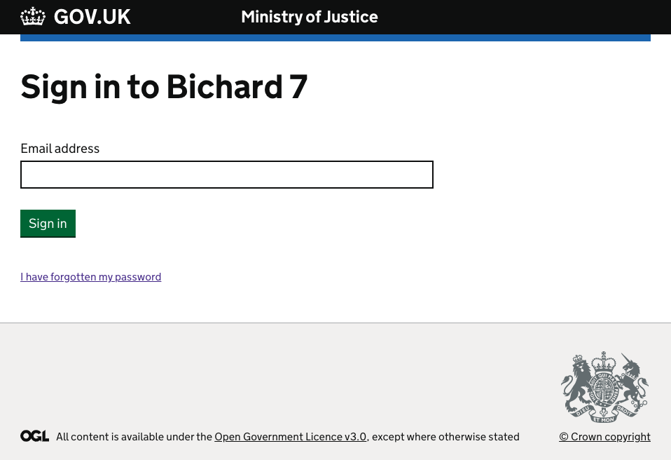
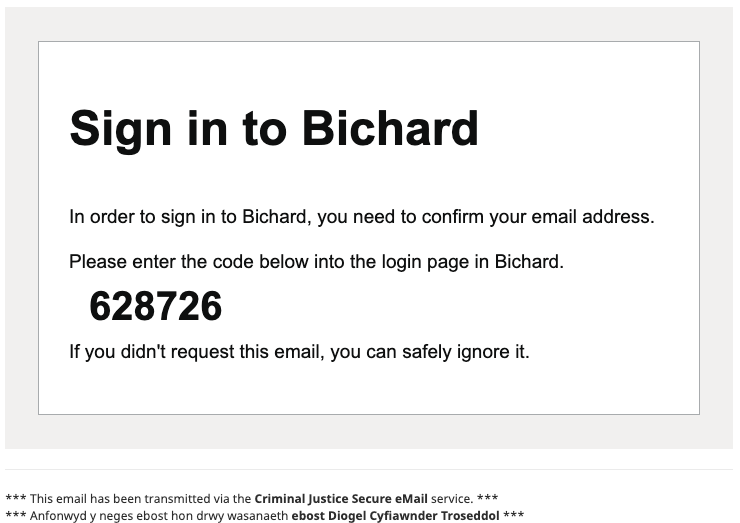
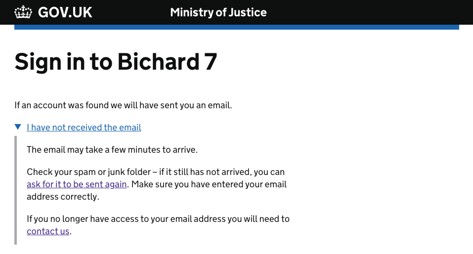
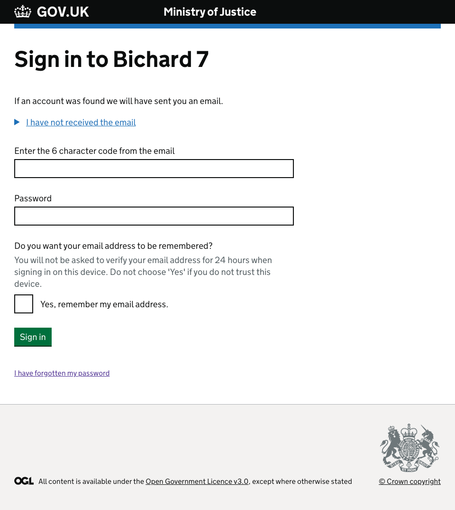
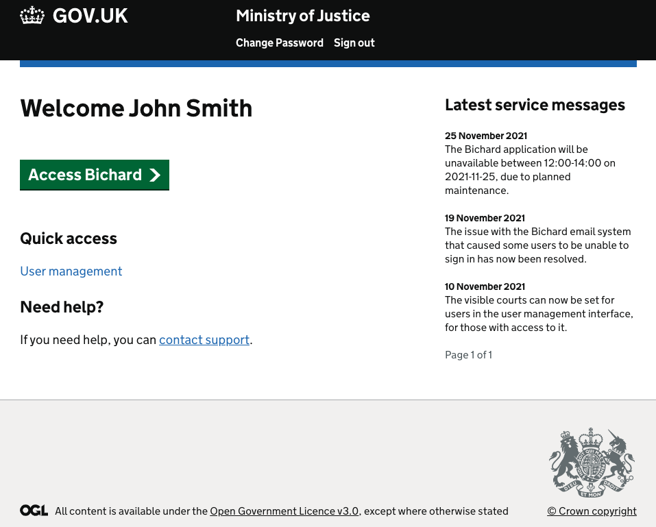
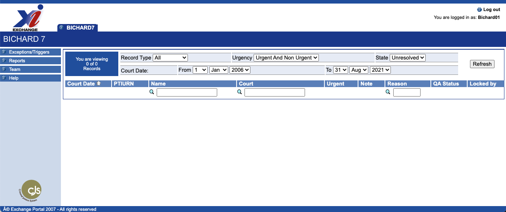

We have introduced a form of MFA (Multi-Factor Authentication) to the Bichard login process, making it more secure but also easier for you to self-manage your Bichard accounts. This is detailed in the section below.

## The new login process
To log-in to Bichard, you will need to visit the following URL from your device, ensuring you are connected to the network:
[http://psnportal.bichard7.pnn.police.uk/](http://psnportal.bichard7.pnn.police.uk/)

Below is a screenshot of the first screen you will be presented with:

To login, you must enter your email address, and click "Sign in".

Once you have done this, you will receive an email (from no-reply@mail.bichard7.service.justice.gov.uk) which will look like this:

Please note, this email is unique to your account only and must not be shared with anyone else. Please do not attempt to create shared accounts within Bichard with shared mailboxes.

If you do not receive the email then you can click the option to resend or to contact support as per the screenshot below, but be sure to check your junk/spam folder first.

You can now copy and paste the code from the email into the corresponding input on the sign-in page, or you can type it in manually.

Once you've entered the code from the email along with your Bichard password, you will see the following screen:

Here you will see any service related messages and announcements related to Bichard, as well as options to log a support ticket.

User Managers will be able to select the "User Management" option which is explained later in this guide.

On the screen above, you will be able to click the "Access Bichard" button to be directed to the Bichard homepage:

