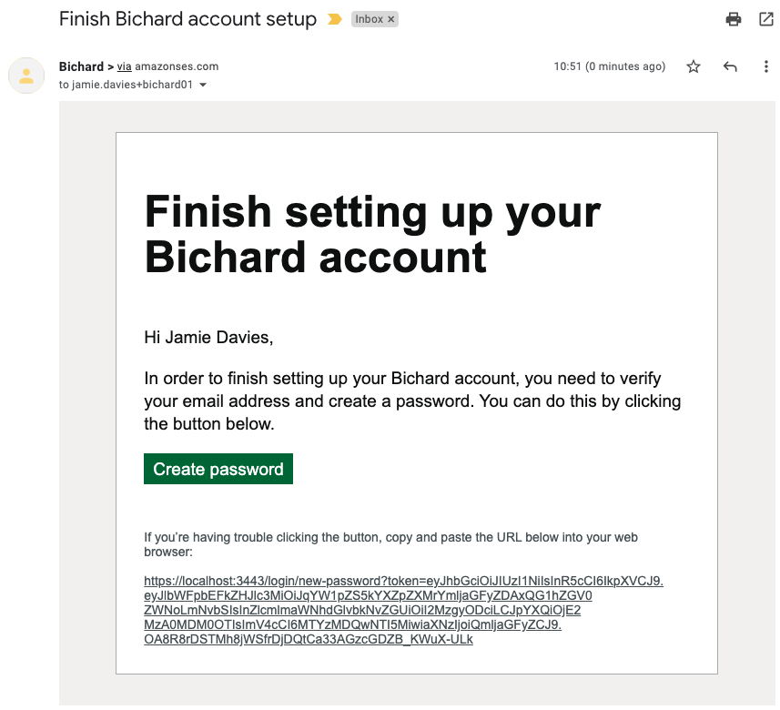
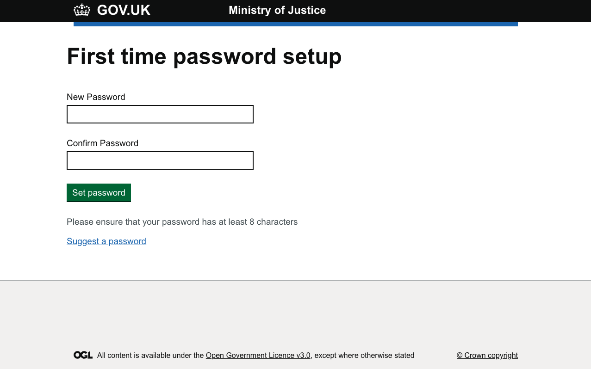
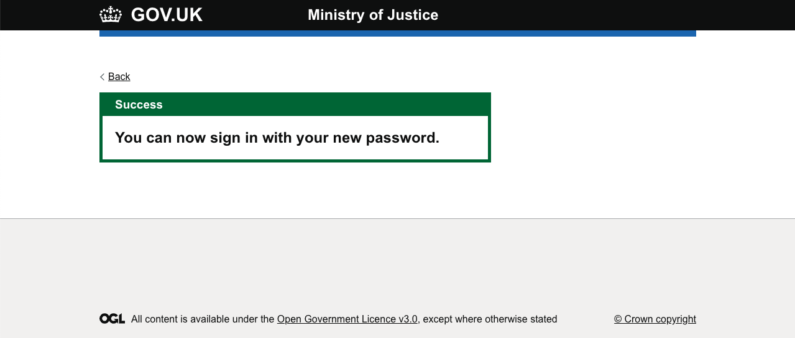

If you have been set up as a new user on Bichard, you will receive an email containing a unique link (to your email address):

By clicking on the "Create password" button or by copying and pasting the URL into a web browser, you will be directed to the screen below in order to set your first Bichard password.

Please note, if the "Create password" button in the screenshot above doesn't work, or if it says the link has expired, you should copy and paste the URL in to a browser window and follow the "I have forgotten my password" link to set a password and access Bichard.

Once the new password is entered and confirmed, the new user will see this confirmation screen:

