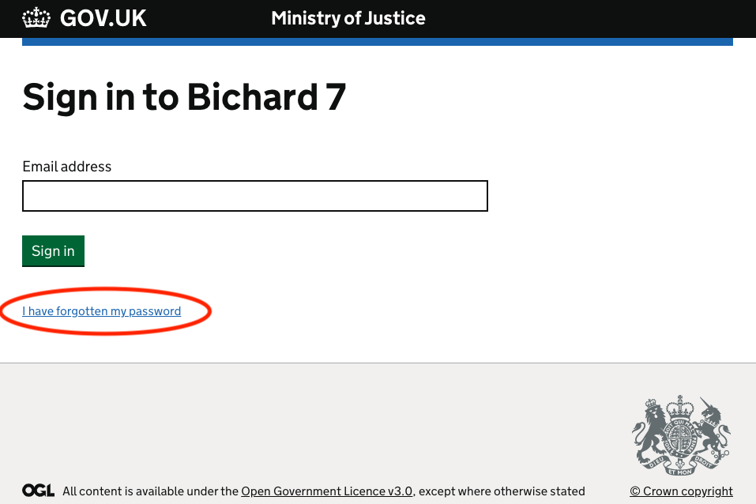
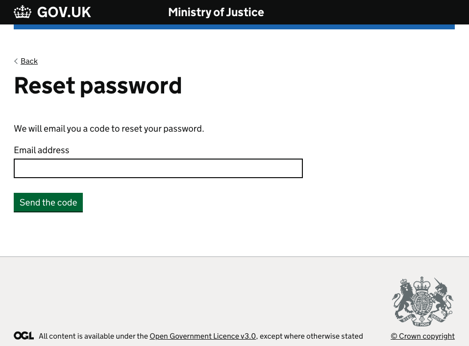
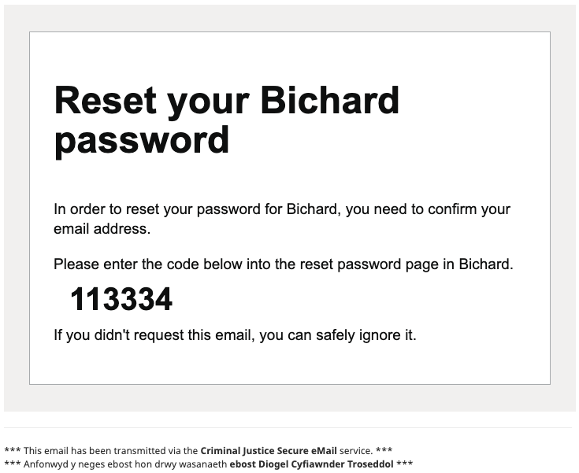
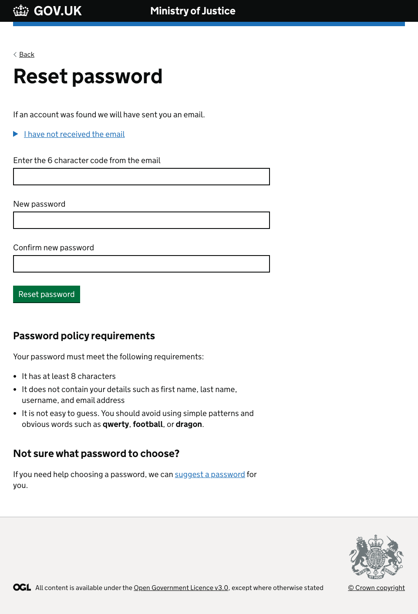
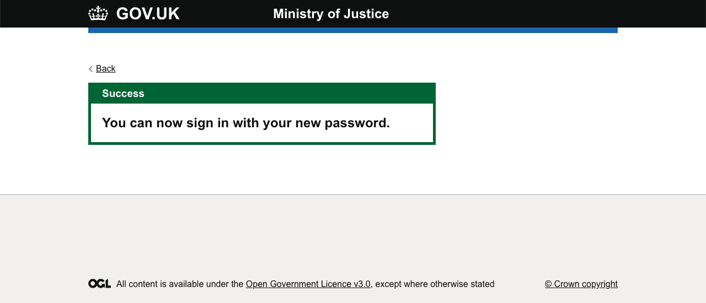

If you cannot remember your Bichard password, you are now able to reset it yourself without having to contact the service desk. On the Bichard login screen, there is an "I have forgotten my password" link as shown below:

If you cannot remember your password or need to reset it,  please click the "I have forgotten my password" button where you will be presented with the screen below:

You can now enter your email address here and click the "Send the link" button. Once you have done this, you will receive an email like the one below.

You can now copy and paste this code into the corresponding input on the password reset screen:

Please enter your new password, and confirm, ensuring the two fields match before clicking on "Reset password" to confirm. You will then see confirmation that you have successfully changed your Bichard password:

Once you see this screen, you can now sign-in as normal using your new password.
