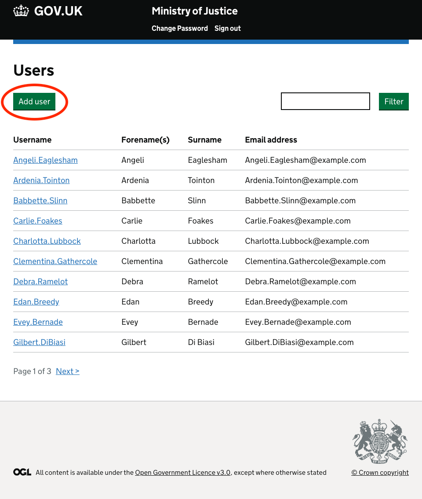
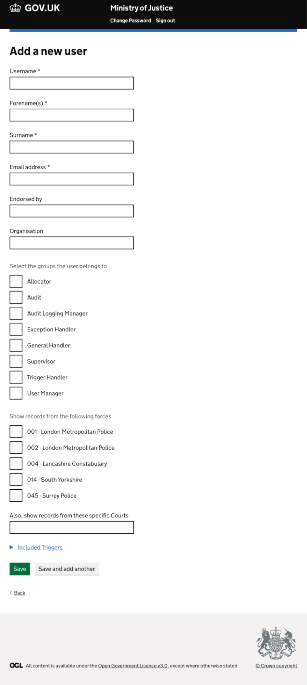
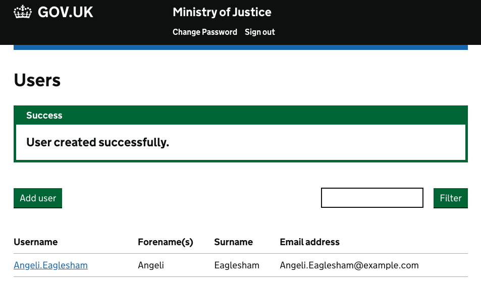

To create a new Bichard user in your Force, navigate to the User List page (accessed by clicking "User Management" option after the initial log-in to Bichard) and click the "Add user" button:

Now enter the details for the new user (paying extra care to select the right role for the user, as well as any Triggers they should be seeing) and submit the request by the "Add user" button:

The new user is created and they will be sent an email prompting them to set a password as described in the "The New User Process" section earlier in this guide.

Please note, this email is unique to the new users account only and must not be shared with anyone else. Please do not attempt to create shared accounts within Bichard with shared mailboxes.

