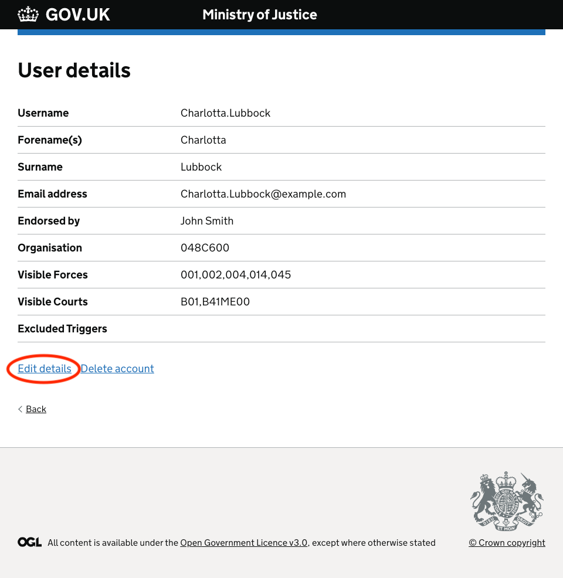
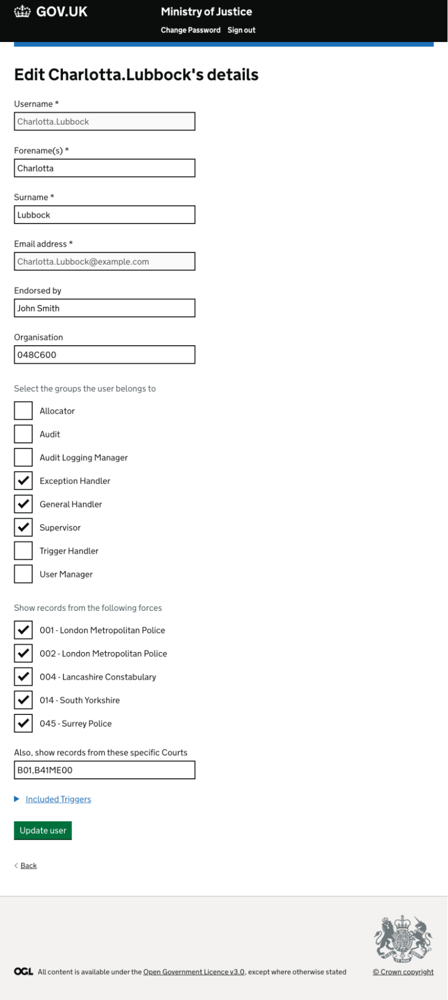
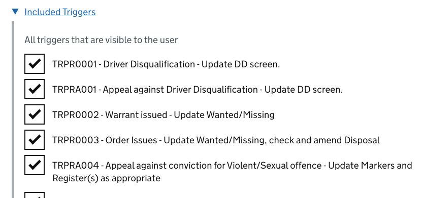
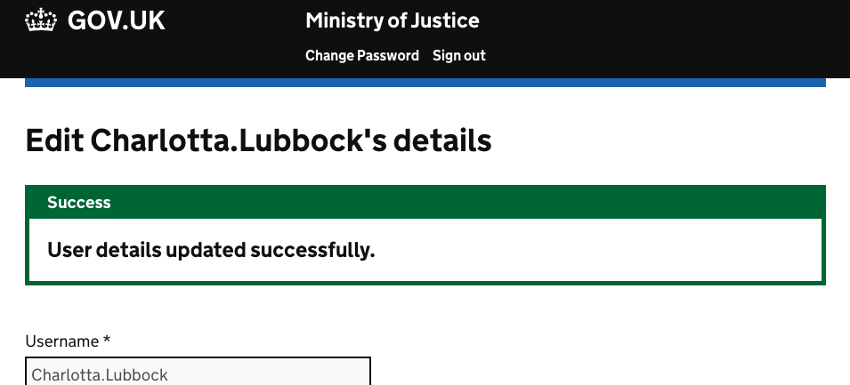
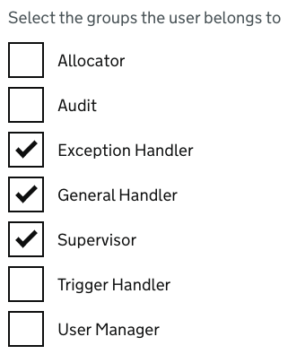

To edit the details of a user in your Force, you can select the "User Management" option from the initial screen displayed upon logging in to Bichard.

You can then click the username of the user you wish to edit from within this list, or search for the user.

You can then click the 'Edit details' link within this page:

Here, you can amend the details for the user and submit the change(s) by clicking the "Update user" button:

This will allow users to see Triggers from other Forces if required as well as from any courts which are selected.

For court codes, as shown in the screenshot above, the user must manually input the values and use comma separation if they are entering more than one court code.

You can also select which Triggers the user should be able to see, as shown below:

Once you have filled in the user details, click "Save" and the requested changes will take effect once the selected user has logged out and back in to Bichard (the logout/login is required for the changes to take effect).

The user details are now updated:

User Managers will be able to edit roles for other users within their Force. The option(s) selected here determine what the user can and cannot do within Bichard:

