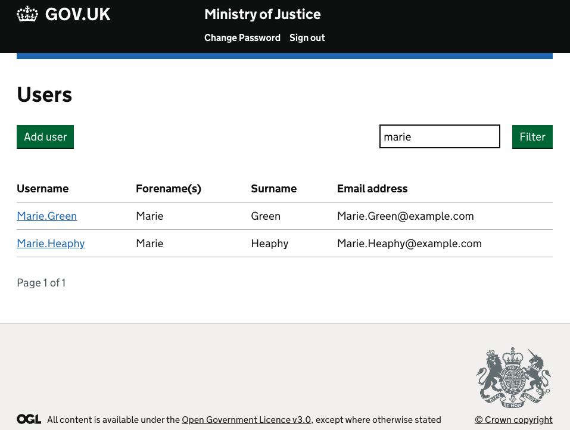
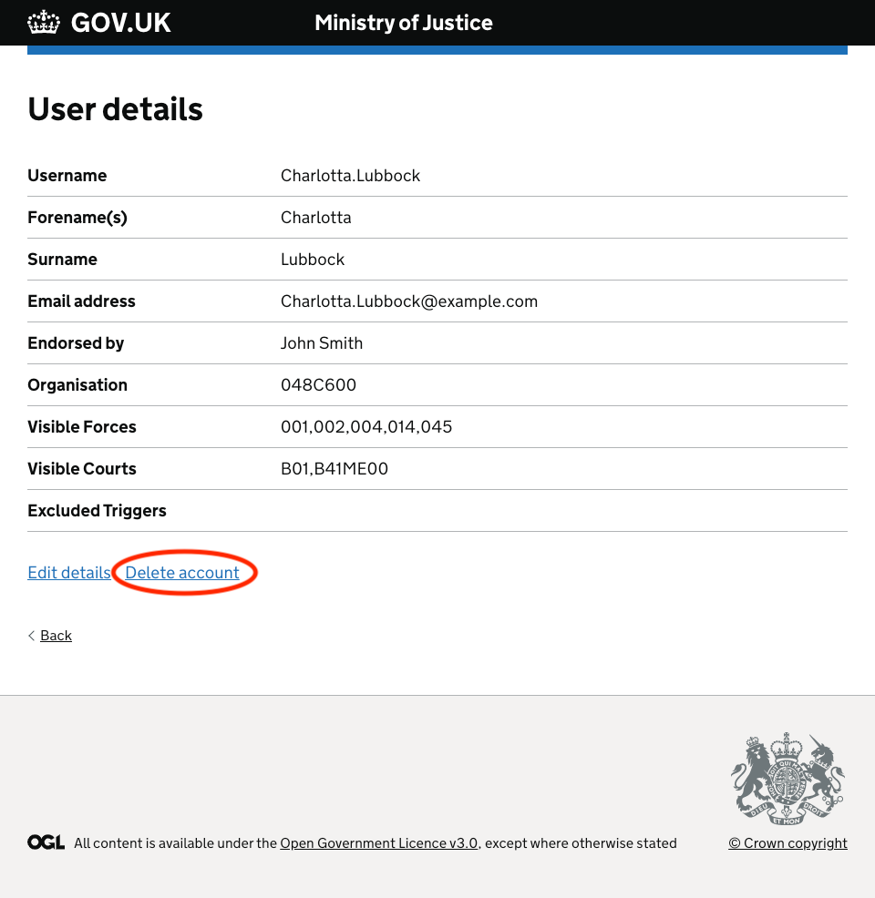
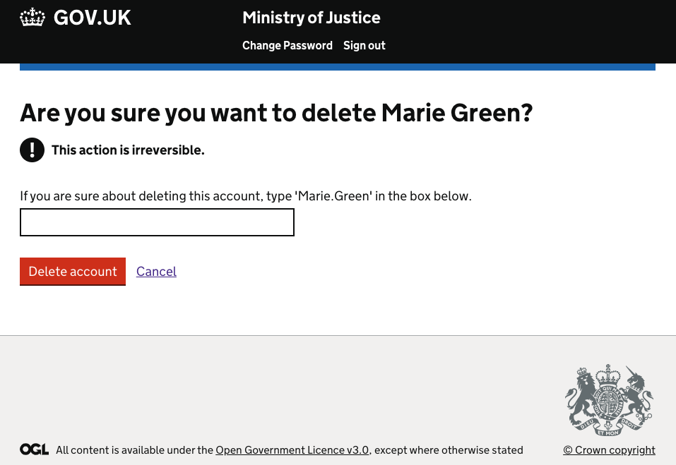
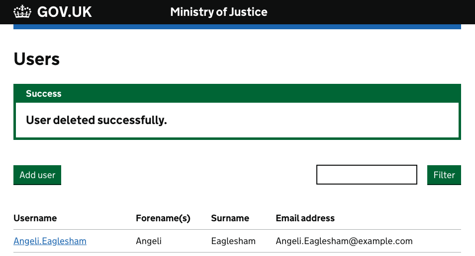

To remove a user from your Force (for example if they have transferred to another Force), navigate to the "User List" page, accessed via the "User Management" option from the initial screen presented upon log-in.

Now click on the username of a specific user, which you can find in the list or via the search option:

You are shown full details for that user, and you can now click the 'Delete account' option:

Once you click "Delete account" you will be asked to type the user's username to confirm you want to delete them, this is for additional security to prevent accidental deletion:

The user account is deleted from Bichard:

