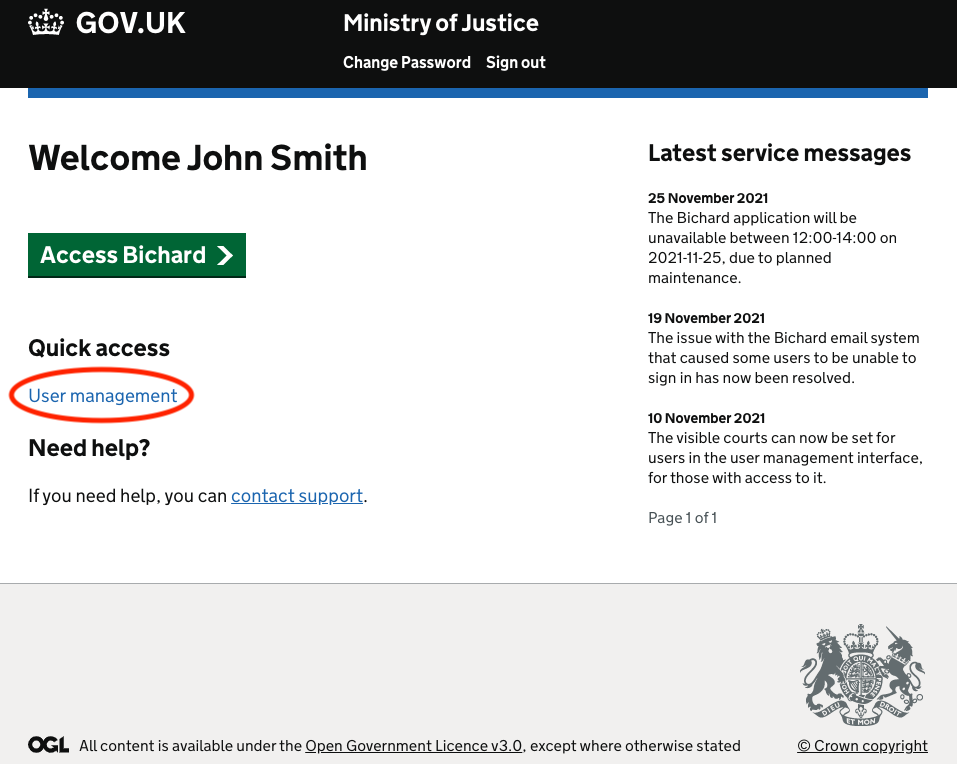
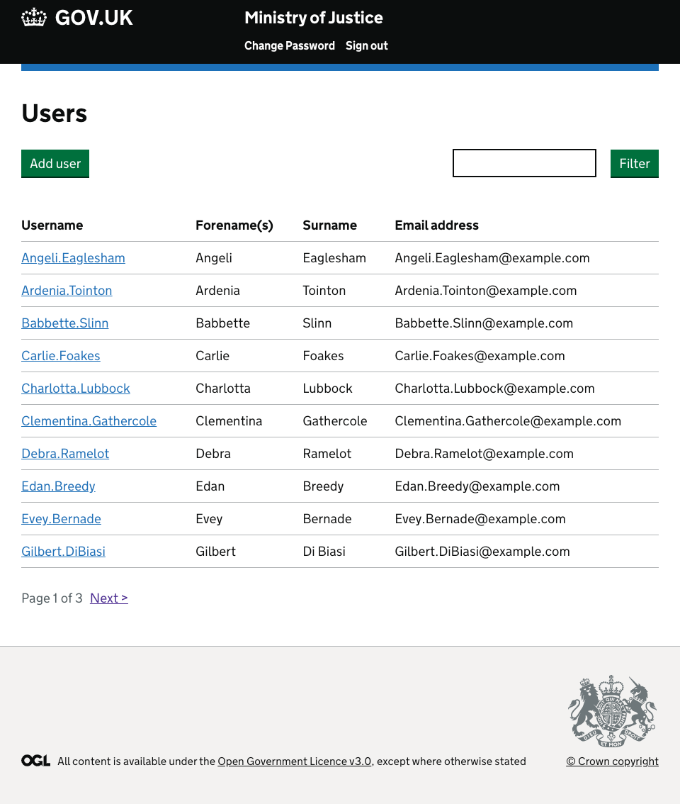
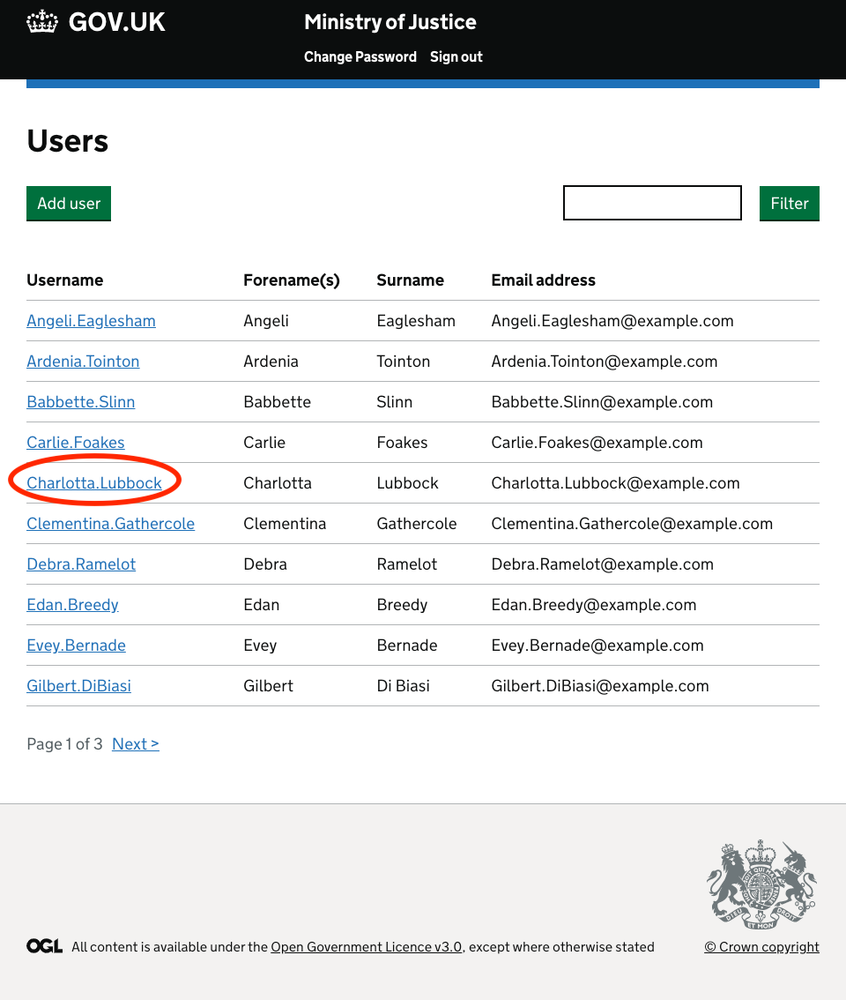
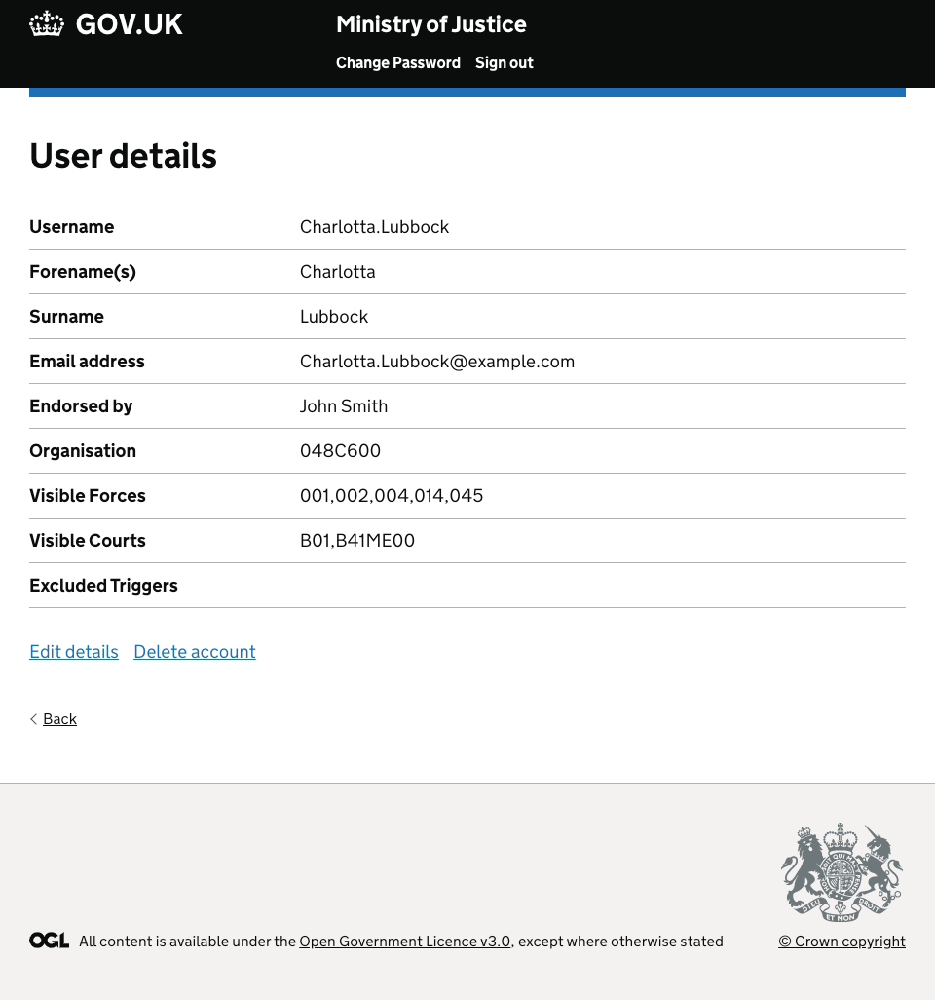
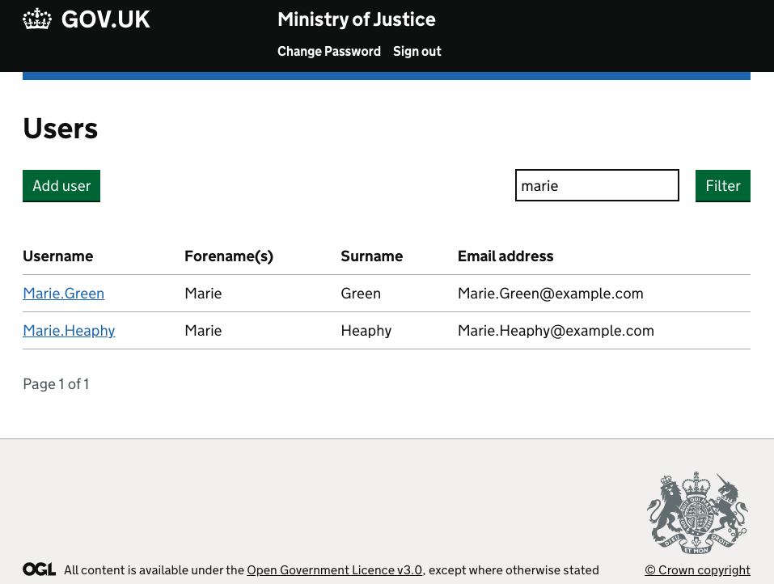

If you are a User Manager logging in to Bichard, you can select the "User Management" option from this screen:

You will then be directed to the "User List" page where you are shown all users in your Force:

Within this screen, you can click on a username:

Which will then show you specific details for that selected user:

You can also use the search functionality to search for a user in your Force:

