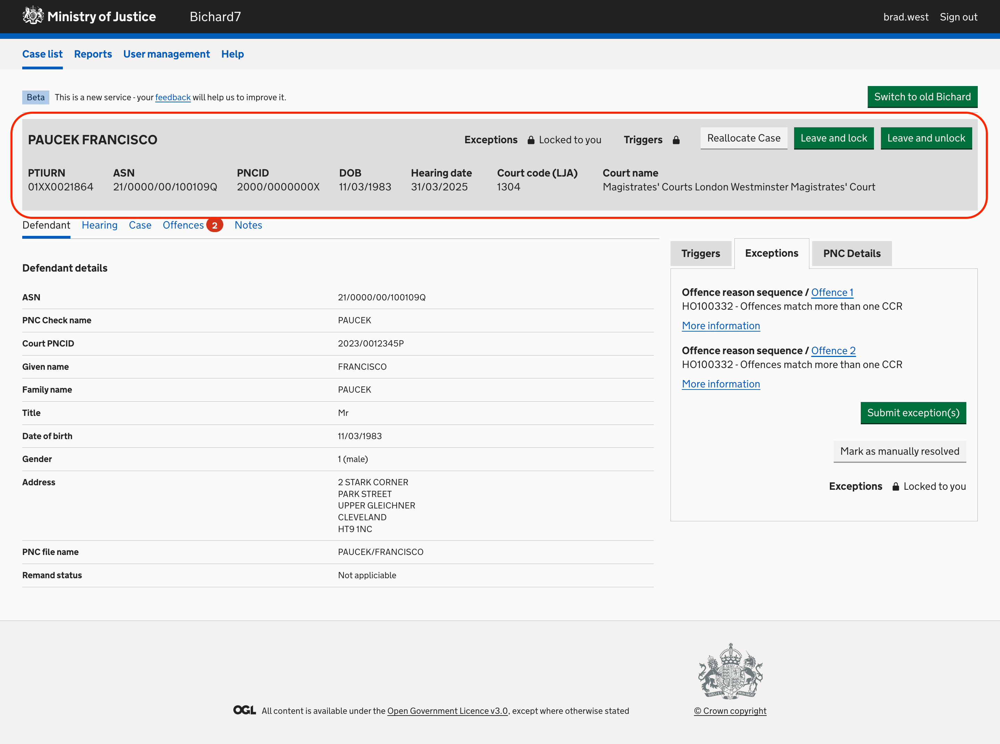

We know that there’s some information which you always need to be able to quickly reference when looking at a case in Bichard. To make sure that this information is always visible, we’ve given it its own box which is permanently visible, no matter how far down the page you scroll. This should make sure that you have the most important information always on screen, and should save you scrolling around to check and recheck information.

The box includes:

- Defendant name
- PITURN
- ASN
- PNCID
- Date of Birth
- Hearing Date
- Court Code
- Court Name

It also shows whether the triggers or exceptions on the case are locked to you or someone else, and shows buttons which allow you to reallocate the case if you have the correct permissions, or navigate back to the Case List whilst locking or unlocking yourself from the case.

If as you use new Bichard you have any feedback on this feature, please make sure to fill in our feedback form so that we can keep improving.

Image(s):

