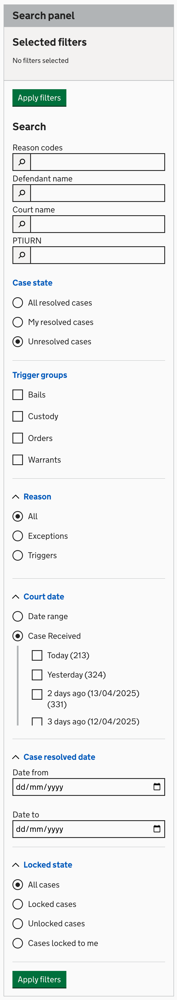
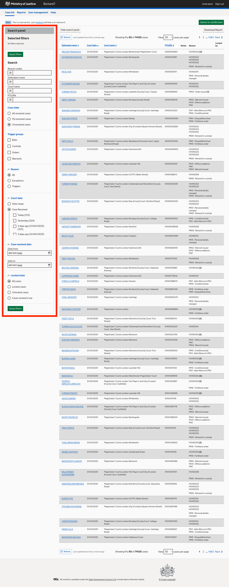

We have improved filtering in new Bichard so that you now have a greater ability to quickly filter the case list to find the cases that you need. We’ve kept the ability to filter on whether there are exceptions or triggers against a case, as well as court date range, and the resolution state of the case, and in addition to these you can now filter on:
- Reason Codes
- Defendant Name
- Court name
- PITURN
- Triggers
- Case Received (i.e. how long ago was the court date?)

With the new filter panel on the left hand side of the page you can add and amend these filters. When you’ve added filters, simply click “apply filters” and the case list will refresh with your filters applied. You can hide the filter panel whenever you want with the “hide filter panel” button to give you more screen space to look at the case list. If you need to add/remove or change a filter, simply click the “show filters” button, and it’ll reappear.

These new filters should help you to more easily focus on the cases that matter to you. You can also download the case list after you’ve applied filters to create your own custom reports.

Images:

