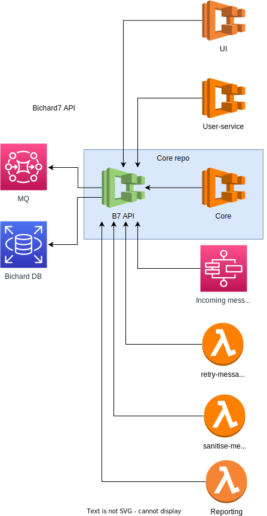

# B7 API

The Bichard7 API is a standardised and secure way to access data from the databases and integrate with MQ. The API will provide a layer of abstraction between the UI and the Postgres DB, allowing for easier maintenance and updates to the database without affecting the application itself, it will also help building a more responsive front end. Additionally, the API will allow for easier integration with other services that need to access the same data, such as UserService, Core, Incoming message handler, AuditLog API, Reporting etc.:

## Where should the code live?
|| Advantages                                                   | Disadvantages                                                |
|-------------------------|--------------------------------------------------------------|--------------------------------------------------------------|
|B7 API in a new repository| - Provides maximum flexibility and independence in development and deployment | - Requires setup and configuration for a new Github repo |
|                          | - Can be easier to manage and maintain over time |- Requires setup and configuration of infrastructure|
|CORE repository| - Less repositories to maintain/setup | - Increased complexity in managing code in core |
|||- Requires additional setup and configuration of infrastructure
|UI repository| - Can reuse existing deployment process | - Tight coupling with the UI |
|| - Can reuse existing DB gateway implementation UI | - Other services depend on UI |
